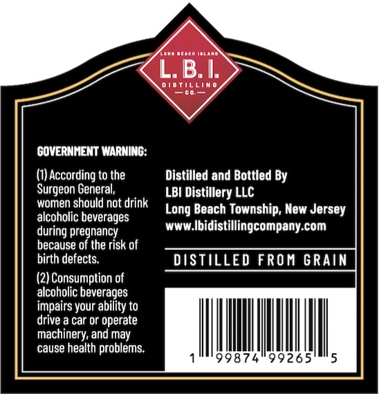
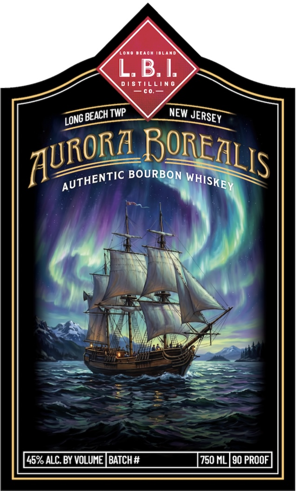

# TTB COLA Label Images - TTBID 26117001000194

**Brand Name:** AURORA BOREALIS BOURBON

**Issue Date:** 04/30/2026

**Origin Code:** 03

**Product Class/Type:** 141

**Source:** [TTB Public COLA Registry](https://ttbonline.gov/colasonline/viewColaDetails.do?action=publicFormDisplay&ttbid=26117001000194)

## Label Images

### Back Label

### Front Label

## Extracted Label Text

*Text extracted via OCR - may contain errors*

**Detected Proof:** 90

### Back Label

enn
L. B. I:
dioTillim
GOVERNMENT WARNING:
(1) According to the
Distilled and Bottled By
Surgeon General,
LBI Distillery LLC
women should not drink
Long Beach Township; New Jersey
alcoholic beverages
during pregnancy
WWW_
Ibidistillingcompany-com
because of the risk of
birth defects:
DISTILLED FROM GRAIN
(2) Consumption of
alcoholic beverages
impairs your ability to
drive a car or operate
machinery; and may
cause health problems:
99874"99265

### Front Label

Lono Deacm iblan
L. B I.
D  S Tilling
C0.
TWP
NEW
BOURBON
45% ALC. BY VOLUME | BATCH #
750 ML |90 PROOF
BEACH
JERSEY
LONG
ROREZLIS
ZURORA
AUTHENTIC_
WHISKEY
