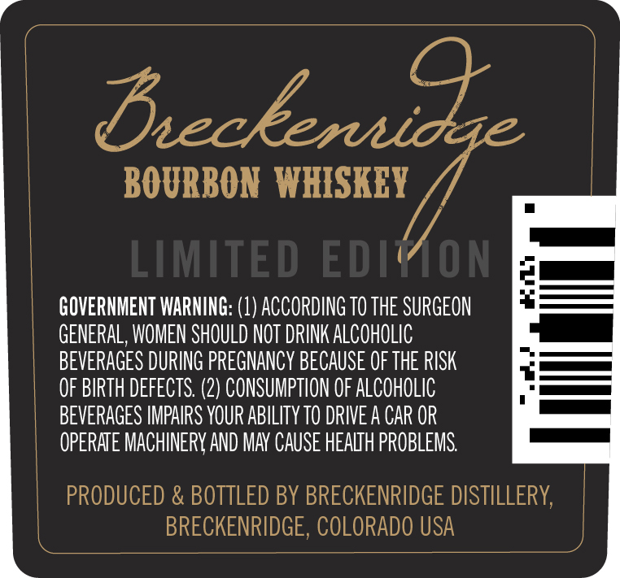
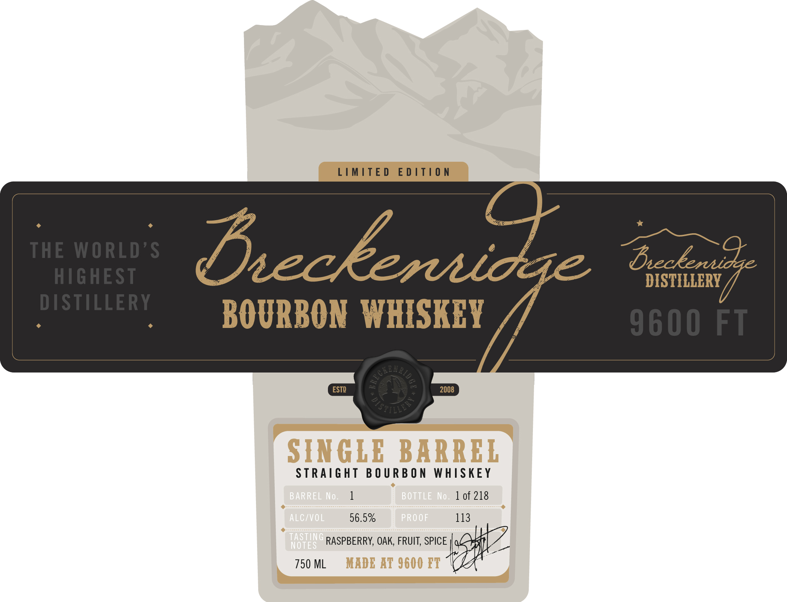
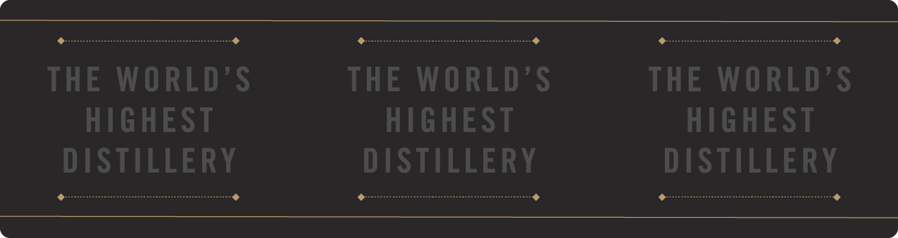

# TTB COLA Label Images - TTBID 26117001000208

**Brand Name:** BRECKENRIDGE

**Fanciful Name:** SINGLE BARREL

**Issue Date:** 04/30/2026

**Origin Code:** 13

**Product Class/Type:** 101

**Source:** [TTB Public COLA Registry](https://ttbonline.gov/colasonline/viewColaDetails.do?action=publicFormDisplay&ttbid=26117001000208)

## Label Images

### Back Label

### Front Label

### Label 3

## Extracted Label Text

*Text extracted via OCR - may contain errors*

**Detected Proof:** 113

### Back Label

Bneckenaicge
BOURBON  WHISKEY
LIMITED
EDIYON
GOVERNMENT WARNING: (1) ACCORDING TO THE SURGEON
GENERAL, WOMEN SHOULD NOT DRINK ALCOHOLIC
BEVERAGES DURING PREGNANCY BECAUSE OF THE RISK
OF BIRTH DEfEctS: (2) CONSUMPTION OF ALCOHOLIC
BEVERAGES IMPAIRS YOUR ABILITY TO DRIVE A CAR OP
OPERAE MACHINERV AND MAY CAUSE HEALIh PROBLEMS
PRODUCED & BOTTLED BY BRECKENRIDGE DISTILLERY
BRECKENRIDGE, COLORADO USA

### Front Label

LIMITE D
E D /T|0 n
THE WORLD'$
Deckeruidae
BecEeruidge
HGHEST
DISTILLERY
DISTILLERY
BOURBON WHISKEY
9600 FT
2
ESTD
2008
SINGLE BARREL
STRAiGht B 0 U RB O N WHISkEY
BARREL No_
BOTTLE No;
1 of 218
ALGIVOL
56.5%
PRO OF
113
TaSTING
NOTES
RASPBERRY, OAK, FRUIT, SPICE
750 ML
MADE AT 9600 FT
( `
P[ 5t

### Label 3

THE WORLD’S

THE WORLD’S

THE WORLD’S

HIGHEST

HIGHEST

HIGHEST

bobo bebahidi

DISTILLERY

bibdate
