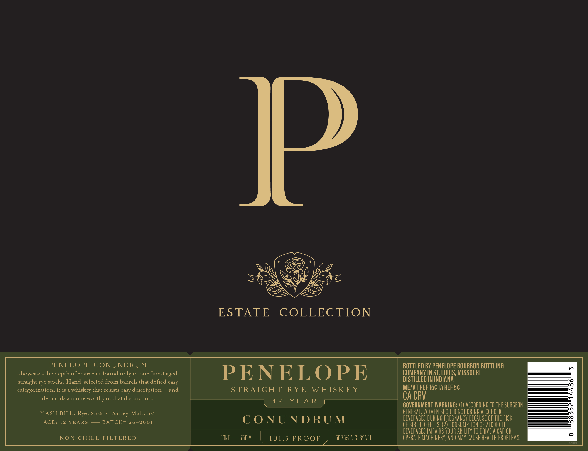
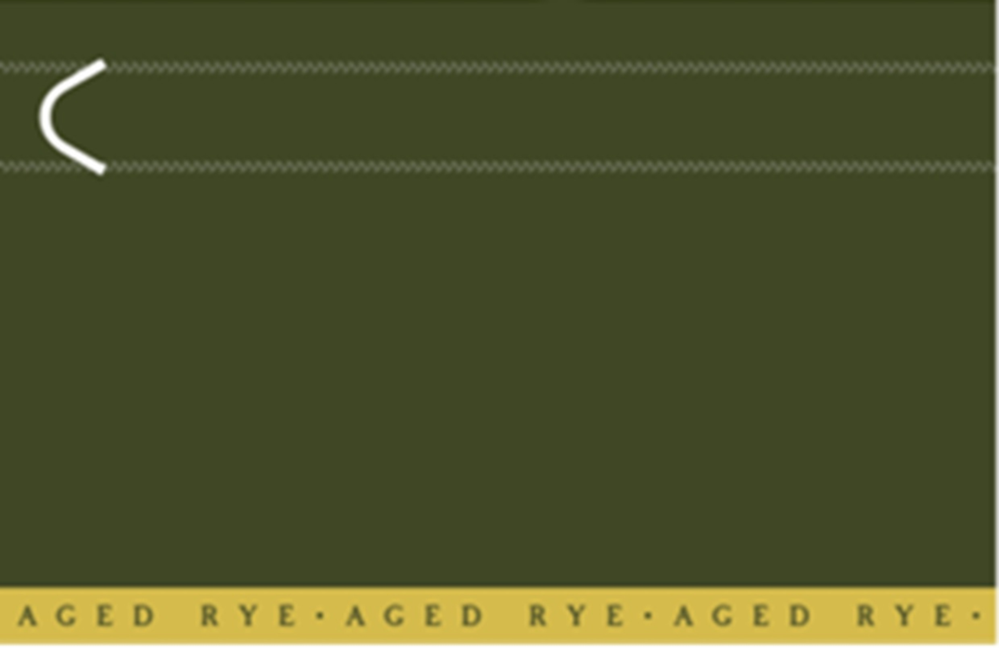

# TTB COLA Label Images - TTBID 26117001000252

**Brand Name:** PENELOPE

**Issue Date:** 04/28/2026

**Origin Code:** 29

**Product Class/Type:** 102

**Source:** [TTB Public COLA Registry](https://ttbonline.gov/colasonline/viewColaDetails.do?action=publicFormDisplay&ttbid=26117001000252)

## Label Images

### Label 1

### Label 2

## Extracted Label Text

*Text extracted via OCR - may contain errors*

**Detected Proof:** 101.5
**Detected Age:** 12 Years

### Label 1

ES

=)

\

Ve

Gye

ESTADESCOREECTION

PENELOPE CONUNDRUM

BOTTLED BY PENELOPE BOURBON BOTTLING

COMPANY IN ST. LOUIS, MISSOURI

showcases the depth of character found only in our finest aged

PENELOPE

DISTILLED IN INDIANA

straight rye stocks. Hand-selected from barrels that defied easy

ME/VT REF 15¢ 1A REF 5¢

categorization, it isa whiskey that resists easy description —and

STRATGH TORY EW EIS IK EY

demands a name worthy of that distinction.

Ape NIB fae

GOVERNMENT WARNING: (1) ACCORDING 10 THE SURGEON

MASH BILE: Rye: 95%

Barley Malt: 5%

GENERAL, WOMEN SHOULD NOT DRINK ALCOHOLIC

AGE: 12 YEARS — BATCH# 26-2001

CONUNDRUM

BEVERAGES DURING PREGNANCY BECAUSE OF THE RISK

OF BIRTH DEFECTS. (2) CONSUMPTION OF ALCOHOLIC

BEVERAGES IMPAIRS YOUR ABILITY 10 DRIVE A CAR OR

NON CHIEL-PILTERED

CONT — 150 ML | 101.5 PROOF 50.75% ALC. BY VOL

OPERATE MACHINERY, AND MAY CAUSE HEALTH PROBLEMS,

### Label 2

AGED

RYE

AGE

D

RYE

AGE

+

RYE
