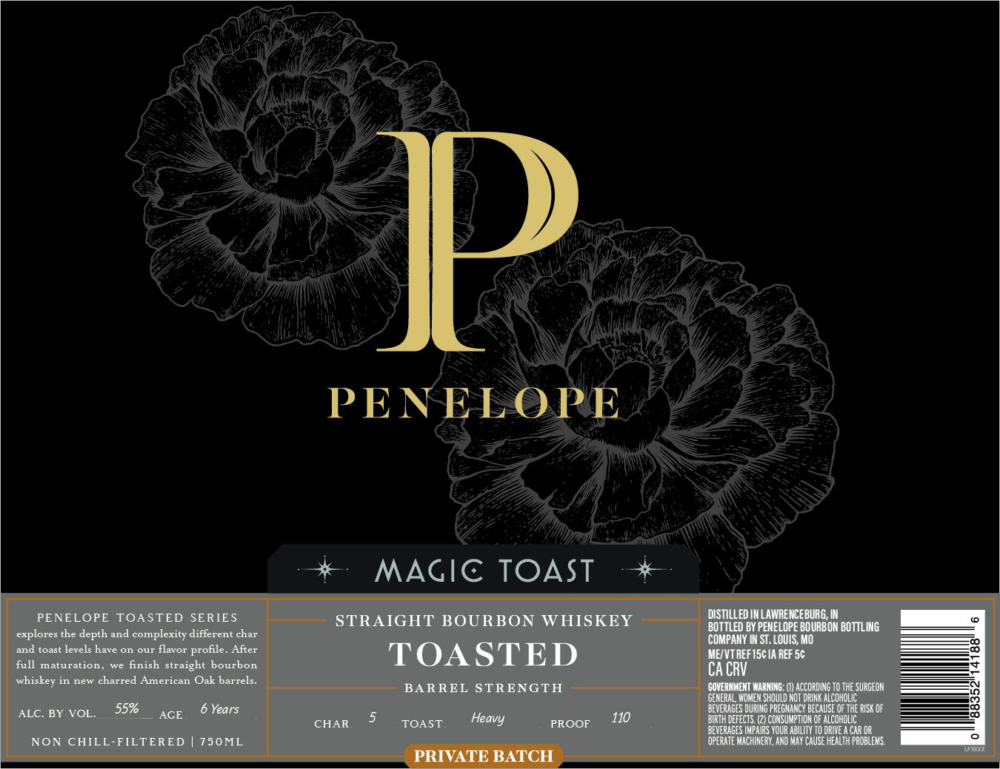
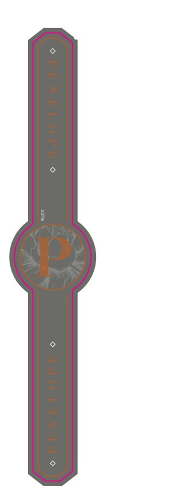

# TTB COLA Label Images - TTBID 26117001000267

**Brand Name:** PENELOPE

**Issue Date:** 04/29/2026

**Origin Code:** 29

**Product Class/Type:** 101

**Source:** [TTB Public COLA Registry](https://ttbonline.gov/colasonline/viewColaDetails.do?action=publicFormDisplay&ttbid=26117001000267)

## Label Images

### Front Label

### Label 2

## Extracted Label Text

*Text extracted via OCR - may contain errors*

*1 image(s) excluded: text did not meet readability threshold*

**Detected Proof:** 110

### Front Label

Ip
PENELOPE
MAGIC TOAST
PENELOPE
TOASTED SERIES
STRAIGHT BOURBON
WHISKEY
DISTILLED IN LAWRENCEBURG, IN
BOTTLED BY PENELOPE BOURBON BOTTLING
explores the depth and complexity different char
COMPANY IN ST, LOUIS; Mo
and toast levels have on our flavor
After
TOASTED
ME/VTREFISc IA REF 5c
full
maturation
we finish
straight bourbon
CA CRV
whiskey in new charred American Oak barrels_
BARREL STRENGTH
COVERNMENT WARNING;
ACCORDING TO THE SURGEON
GENERAL, WOMEN ShouLD NOT DRINK ALCoholIc
ALC. BY
VOL
55%
AGE
Years
beverAGES DURING PREGMAncy BEcause Of The RUSK OF
CHAR
TOAST
PROOF
110
BIRTH dEfEcts: (2) CONSUMPTION OF aLCOHOLIC
BEVERAGES IMPAIRS YOUR ABILITY TO DRIVE
CaR OR
NON CHILL-FLTERED
750ML
operate Machinery, AND MAY cause HEalth problems.
PRIVATE BATCH
profile_
Heavy
