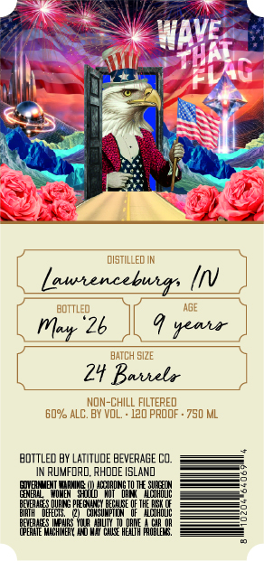
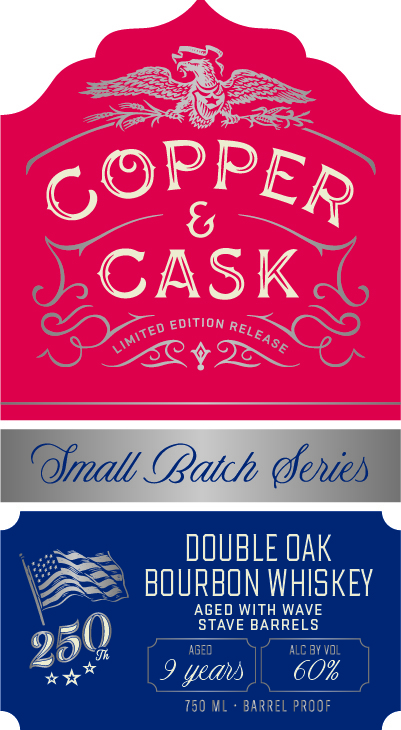

# TTB COLA Label Images - TTBID 26117001000326

**Brand Name:** COPPER & CASK

**Issue Date:** 05/01/2026

**Origin Code:** 40

**Product Class/Type:** 141

**Source:** [TTB Public COLA Registry](https://ttbonline.gov/colasonline/viewColaDetails.do?action=publicFormDisplay&ttbid=26117001000326)

## Label Images

### Back Label

### Front Label

### Label 3

## Extracted Label Text

*Text extracted via OCR - may contain errors*

**Detected Proof:** 120

### Back Label

diSTILLED IN
lawencebuers
BQTTLED
AGE
"26
seah
BATCH GIZE
2y Bauela
NON-ChILL FILTERED
Ep% ALC. BY VOL
120 pROOF . 750 ML
BOTTLED BY LATITVOE BEWVERAGE CO
RuMFIRD, RHDDE ISLAND
Exzikza
Hmewr
1EZESEIE
FEEHETTEHRE HHTFNHEEHEHH FobEE
WAVE
HaT
Mar

### Front Label

{
CASK
EDITION
Ofmall CBatch (enies
DOUBLE Oak
BOURBON WHISKEY
AGED WITH WAVE
STAVE BARRELS
aged
ALC By voL
9 yeas
60%
750 ML
BarreL PROOF
PPER
Co
RELEASE
Limited
250

### Label 3

COPPER & CASK Say

MSW 8 WdddOd

a=
