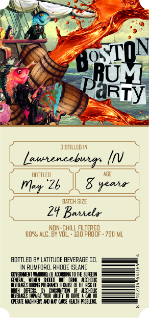
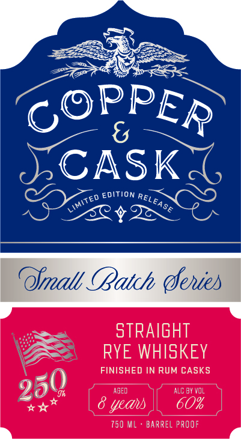

# TTB COLA Label Images - TTBID 26117001000332

**Brand Name:** COPPER & CASK

**Issue Date:** 05/06/2026

**Origin Code:** 40

**Product Class/Type:** 102

**Source:** [TTB Public COLA Registry](https://ttbonline.gov/colasonline/viewColaDetails.do?action=publicFormDisplay&ttbid=26117001000332)

## Label Images

### Back Label

### Front Label

### Label 3

## Extracted Label Text

*Text extracted via OCR - may contain errors*

**Detected Proof:** 120

### Back Label

RM
distILLEDIN
lawencebuers
bdttled
AGE
'26
yeui
DATCH SIZE
2y Baiielo
NON-ChIlL FILTERED
60% ALC. BY VOL
120 pROOF . 750 ML
BDTTLEd BY LatItuDE BEVERAGE CO.
RuMfiRD, Rhdde ISLAND
DQVBMIBI
HOLRDNG TO THE SURLON
@EEupeoulhm
Mmufruz
DRTE
@PEPLTE MUCHINERY uO MMX" Chlc HEWLTH MOBLE5S,
89 ON
PaRTy
Mar

### Front Label

{
CASK
EDITION
ofmall (Batch (eies
stRAIGHT
RYE WHISKEY
FINISHED IN RUM CASKS
AGED
ALC BY vol
yeau
60%
750 ML
Barrel PROOF
PPER
C@
RELEASE
LIMIted
250

### Label 3

COPPER & CASK Say

MSW 8 WdddOd

a=
