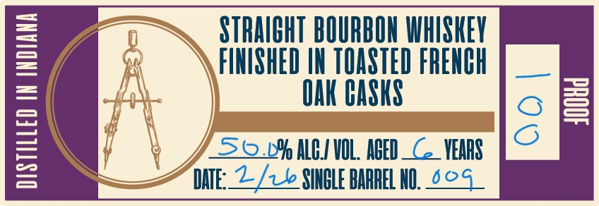
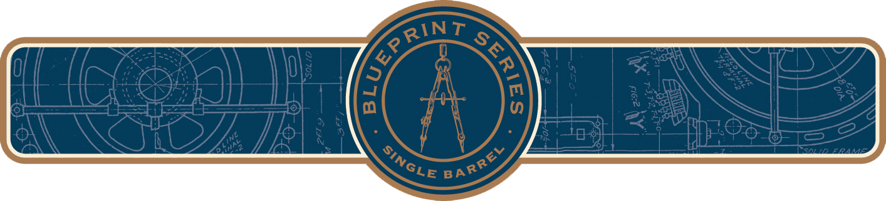

# TTB COLA Label Images - TTBID 26117001000393

**Brand Name:** OLD STEELHOUSE DISTILLERY BLUEPRINT SERIES

**Fanciful Name:** SINGLE BARREL

**Issue Date:** 04/28/2026

**Origin Code:** 22

**Product Class/Type:** 101

**Source:** [TTB Public COLA Registry](https://ttbonline.gov/colasonline/viewColaDetails.do?action=publicFormDisplay&ttbid=26117001000393)

## Label Images

### Front Label

### Label 2

### Label 3

## Extracted Label Text

*Text extracted via OCR - may contain errors*

*1 image(s) excluded: text did not meet readability threshold*

### Front Label

OLD
STEELHOUSF
D + S Tilk E RY
78
0
BOTTLED
BY
OLD
840
4a STEELHOUSE
E R
L
COXS_CREEK KENTUCKY
WWW THEOLDSTEELHOUSE COM
{
GOVORNMGENG
WARNUGeon
General;
women
should
not
228
drink _
Icoholic beverages during
8
Hbd
Dregnaececbecaz)se onsuenption
defects
(2) Consumption
of alcoholic beverages impairs
your
ability
drive
Oooo"0ooo0
operate
machinery;
may
S | N G LE
B A R R E L
375ml
cause health problems:
'375mt:
GPRIN)
G
K64e BARrYY
Vott
1
and

### Label 2

STRHICHT BOURBON WHISHEV
1
FINISHED IN TOASTED FRENHH
=
OHK HASKS
4
]
56LY ALHI VOL. ABED _ C
VEARS
IHE:_2/z e SIHHLE BARREL HU;
6og
8
