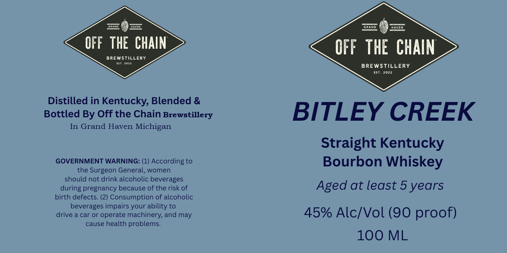

# TTB COLA Label Images - TTBID 26117001000407

**Brand Name:** BITLEY CREEK

**Fanciful Name:** STRAIGHT KENTUCKY BOURBON WHISKY

**Issue Date:** 05/05/2026

**Origin Code:** 06

**Product Class/Type:** 141

**Source:** [TTB Public COLA Registry](https://ttbonline.gov/colasonline/viewColaDetails.do?action=publicFormDisplay&ttbid=26117001000407)

## Label Images

### Label 1

## Extracted Label Text

*Text extracted via OCR - may contain errors*

**Detected Proof:** 90
**Detected Age:** 5 Years

### Label 1

D
GrANd
DhAven
OFF THE CHAIN
OFF THE CHAIN
BREWstillery
BREWSTILLERY
2099
Distilled in Kentucky Blended &
Bottled By Off the Chain Brewstillery
BITLEY CREEK
In Grand Haven Michigan
Straight Kentucky
GOVERNMENT WARNING: (1) According to
Bourbon Whiskey
the Surgeon General, women
should not drink alcoholic beverages
pregnancy because of the risk of
Aged at least 5 years
birth defects. (2) Consumption of alcoholic
beverages impairs your
drive a car or operate machinery; and may
45% Alc/Vol (90 proof)
cause health
problems:
100 ML
during
ability
