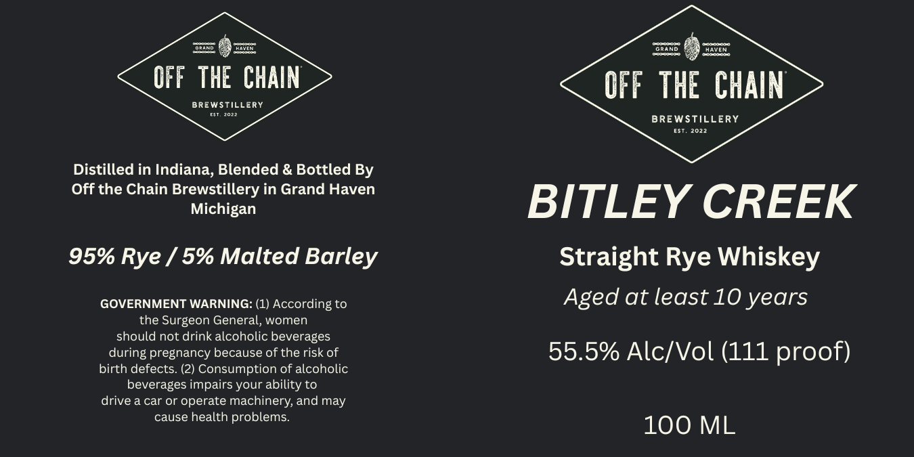

# TTB COLA Label Images - TTBID 26117001000419

**Brand Name:** BITLEY CREEK

**Issue Date:** 05/05/2026

**Origin Code:** 06

**Product Class/Type:** 102

**Source:** [TTB Public COLA Registry](https://ttbonline.gov/colasonline/viewColaDetails.do?action=publicFormDisplay&ttbid=26117001000419)

## Label Images

### Label 1

## Extracted Label Text

*Text extracted via OCR - may contain errors*

**Detected Proof:** 111
**Detected Age:** 10 Years

### Label 1

D
GrANd
DhAven
OFF THE CHAIN
OFF THE CHAIN
BREWstillery
BREWSTILLERY
Tnen
Distilled in Indiana, Blended & Bottled By
Off the Chain Brewstillery in Grand Haven
Michigan
BITLEY CREEK
95% Rye / 5% Malted Barley
Straight Rye Whiskey
GOVERNMENT WARNING: (1) According to
Aged at least 10 years
the Surgeon General, women
should not drink alcoholic beverages
during pregnancy because of the risk of
55.5% Alc/Vol (111 proof)
birth defects: (2) Consumption of alcoholic
beverages impairs your
to
drive a car or operate
machinery; and may
cause health problems:
100 ML
ability
