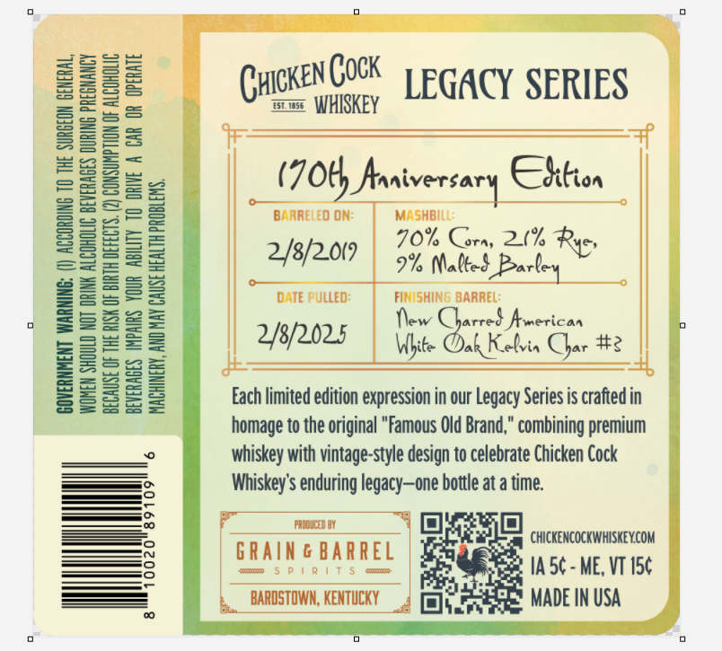
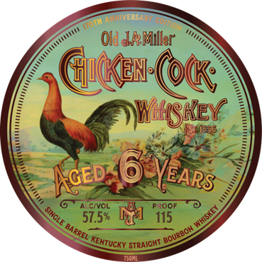
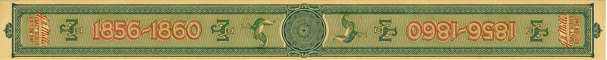

# TTB COLA Label Images - TTBID 26117001000605

**Brand Name:** CHICKEN COCK WHISKEY

**Issue Date:** 04/30/2026

**Origin Code:** 22

**Product Class/Type:** 101

**Source:** [TTB Public COLA Registry](https://ttbonline.gov/colasonline/viewColaDetails.do?action=publicFormDisplay&ttbid=26117001000605)

## Label Images

### Back Label

### Front Label

### Label 2

## Extracted Label Text

*Text extracted via OCR - may contain errors*

*1 image(s) excluded: text did not meet readability threshold*

**Detected Proof:** 115

### Back Label

(uickeNCOK | GACY SERIES

zm WHISKEY

TO ORIVE A CAR OR OPERATE

HY
(70t) Araiversary CShiten ;

i BARRELED ON: MASHBILL:
70% Corn, 2% Rye,
2/8/2007 | 5% Matted Bares
% DATE PULLED: ec Geely
2/w/2005 | (pe riches Che 2
eee Oe |
Each limited edition expression in our Legacy Series is crafted in
homage to the original "Famous Old Brand," combining premium
whiskey with vintage-style design to celebrate Chicken Cock
Whiskey's enduring legacy—one bottle at a time.
GRAING BARREL | Seem

GOVERNMENT WARNING: (!) ACCORDING TO THE SURGEON GENERAL,
WOMEN SHOULD NOT ORINK ALCOHOLIC BEVERAGES DURING PREGNANCY

CHICKENCOCKWHISKEY.COM

BARDSTOWN, KENTUCKY

### Front Label

IVERSARU
Old &RMiller
Gukex @OQ;
We(iey
1830
Koeb;6 VEARS
AlciVOL
Proof
57.5%
115
WhIskey_
SIHGLE [
BARREL E
BOURBOH '
KehTUCKY =
SIRAIGHI
