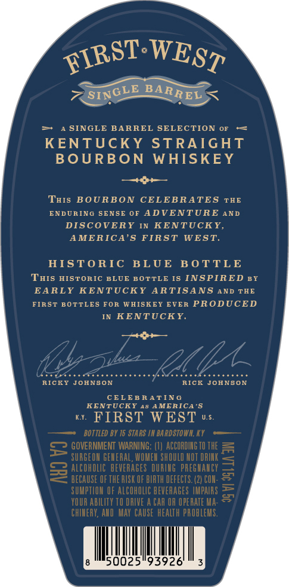
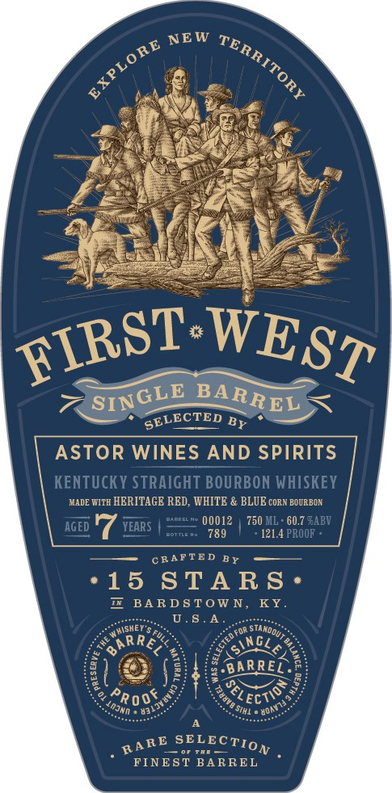
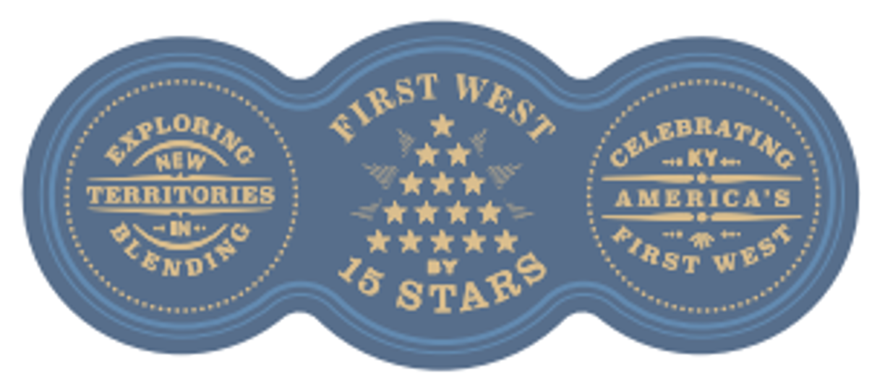

# TTB COLA Label Images - TTBID 26117001000617

**Brand Name:** FIRST WEST

**Issue Date:** 04/29/2026

**Origin Code:** 22

**Product Class/Type:** 101

**Source:** [TTB Public COLA Registry](https://ttbonline.gov/colasonline/viewColaDetails.do?action=publicFormDisplay&ttbid=26117001000617)

## Label Images

### Back Label

### Label 1

### Label 3

## Extracted Label Text

*Text extracted via OCR - may contain errors*

**Detected Proof:** 121.4

### Back Label

SINGLE BARREL SELECTION
KENTUCKY
STRAIGHT
B OURBON
WHISKEY
THIS
BOURBON
CELEBRATES
THE
ENDURING SENSE 0F ADVENTURE
AND
DISCOVERY
KENTUCKY,
AMERICA'5
FIRST
WEST.
HISTORIC
BLUE
B O TTLE
THIS HISTORIC BLUE BOTTLE IS INSPIRED BY
EARLY KENTUCKY
ARTISANS
AND THE
FIRST BOTTLES
FOR WAISKEY
EVER PRODUCED
KENTUCKY
RICKY
JOHNBON
RICK
JOHNBON
CELEB R A TIN
KENTUCKY 43 AMERICA'5
KI
FIRST WEST
U.5
BOTTLED BY 15 STARS IN BARDSTOHA; KY
5 GOVERNMENT WARWNG: (L #TEORDHG TV ThE
SURGEOA GELERAL, MOMEL ShOULD ILOT DRIK
8
BEEAUSI UF THEVEBA BF BIRTH MEF EETEGZLUFY
1
SUMPTLO OF ALCOHOLIC BEVERAGES MPAIRS
YOUR AbILITY TO DRIE
CAR OR OPERATE Ma:
CHIVERY, AVD   MaY   CAUSE  HEALTH PROBLEVS.
50025"93926
FIRST
WEST
'SINGLE
BARREL

### Label 1

SELECTED Bp
ASToR WINES AND SPIRITS
KENTUCKY STRAIGHT BOURBON WHISKEY
MADE WITH HERITAGE RED, WHITE
BLUE CORN BOURBON
AGED
YEARS
00012
750 ML
60.7 GABV
RoTTLR Ka
789
121.4 PROOF
CRAFTE D
15
STA R S '
BA R DSTOW N, KY_
U.$ . A
arre
SiNGLA
#BARREL_
Rr
SIHI
FINEST BARREL
NEW
TERRITORY
EXPLORE
FIRST
WEST
SINGLE
BARREL
BY
nhished"
~standoute
(
FULL
1
1
8
'Ectio
1
'00F
'80aii
Injnn
'03137.
SELECTION
RARE

### Label 3

Hom
@LEBRATING
d
Ky
TERRITORIES
I
AMERICA 8
ON~
I0o
Se
RnD/@
T*ttt
4
ET
7 8TARS
TIRST
WEST
ALORING
*
WEST
PIRST
