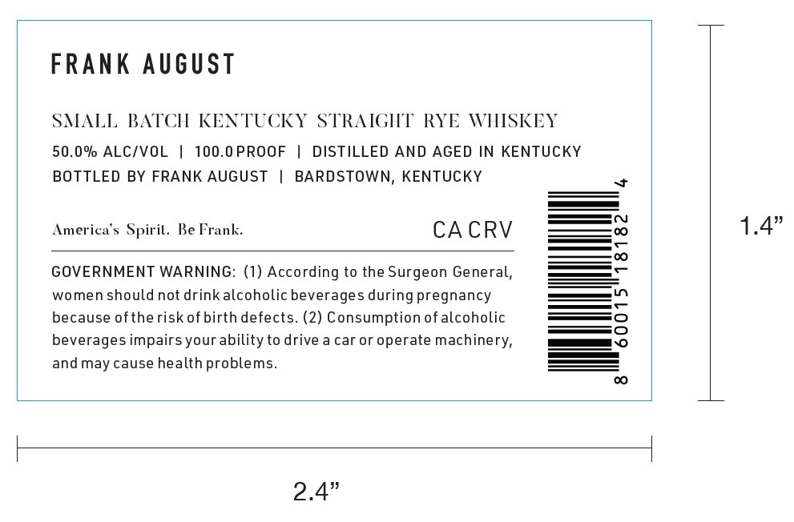
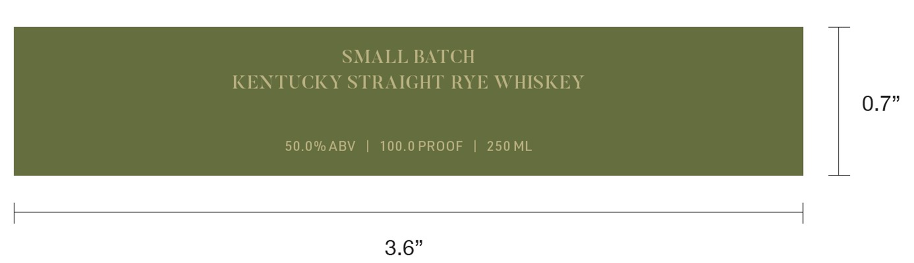

# TTB COLA Label Images - TTBID 26117001000639

**Brand Name:** FRANK AUGUST

**Issue Date:** 04/29/2026

**Origin Code:** 22

**Product Class/Type:** 102

**Source:** [TTB Public COLA Registry](https://ttbonline.gov/colasonline/viewColaDetails.do?action=publicFormDisplay&ttbid=26117001000639)

## Label Images

### Label 1

### Label 2

## Extracted Label Text

*Text extracted via OCR - may contain errors*

**Detected Proof:** 100

### Label 1

FRANK August
SMALL
BATCH KENTUCKY
STRAIGHT
RYE WHISKEY
50.0% ALC/VOL
100.0PROOF
DISTILLED AND AGED IN KENTUCKY
BOTTLED BY FRANK AUGUST
BARDSTOWN, KENTUCKY
Ameriea $ Spiril. Be Frank:
CA CRV
1.4"
8
GOVERNMENT WARNING: (1) According to the Surgeon General,
women should not drink alcoholic beverages during pregnancy
because oftherisk ofbirth defects. (2) Consumption ofalcoholic
beverages impairs your ability to drive a car or operate machinery,
8
and may cause health problems_
2.4"

### Label 2

SMALL BATCH
KENTUCKY STRAIGHT RYE WHISKEY

0.7"

00.0 PROOF
