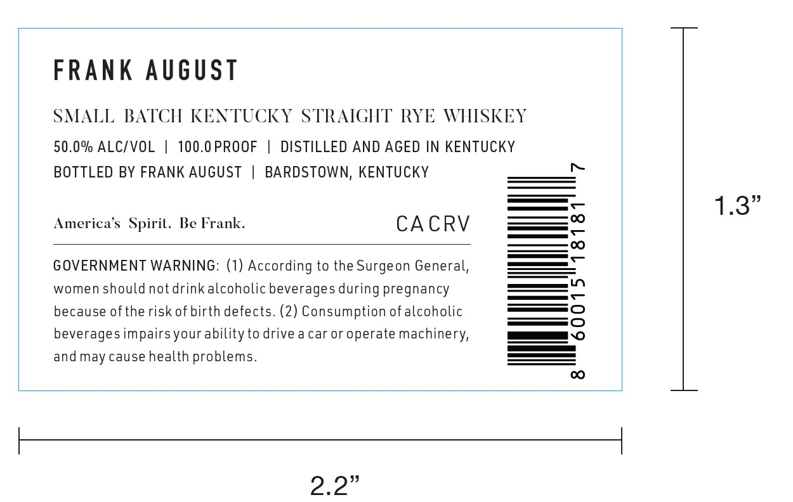
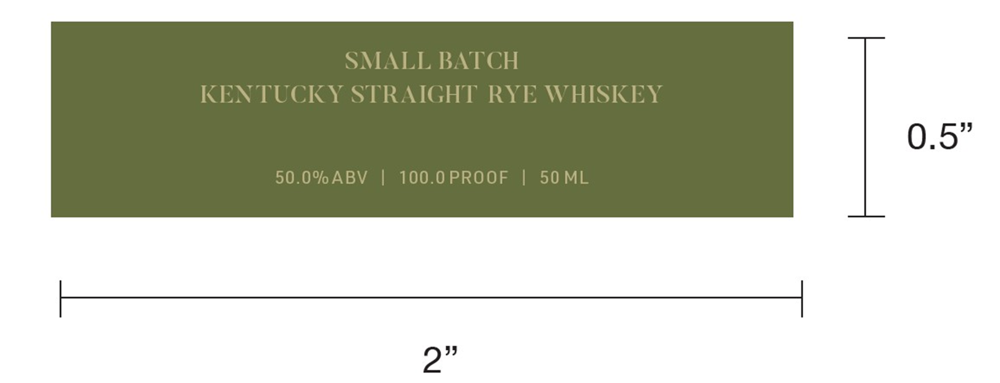

# TTB COLA Label Images - TTBID 26117001000644

**Brand Name:** FRANK AUGUST

**Issue Date:** 04/29/2026

**Origin Code:** 22

**Product Class/Type:** 102

**Source:** [TTB Public COLA Registry](https://ttbonline.gov/colasonline/viewColaDetails.do?action=publicFormDisplay&ttbid=26117001000644)

## Label Images

### Label 1

### Label 2

## Extracted Label Text

*Text extracted via OCR - may contain errors*

**Detected Proof:** 100

### Label 1

FRANK
August
SMALL BATCH KENTUCKY STRAIGHT RYE WIISKEY
50.0% ALCIVOL
100.0 PROOF
DISTILLED AND AGED IN KENTUCKY
BOTTLED BY FRANK AUGUST
BARDSTOWN, KENTUCKY
1.3"
America's Spiril.
Be Frank.
CA CRV
6
5
GOVERNMENT WARNING: (1) According to the Surgeon General,
women should not drink alcoholic beverages during pregnancy
because ofthe risk ofbirth defects. (2) Consumption ofalcoholic
2
beverages impairs your ability to drive a car or operate machinery,
and may cause health problems_
CO
2.2"

### Label 2

SMALL BATCH
KENTUCKY STRAIGHT RYE WHISKEY
0.5"
50.0% ABV
100.0 PROOF
1
50 ML
2"
