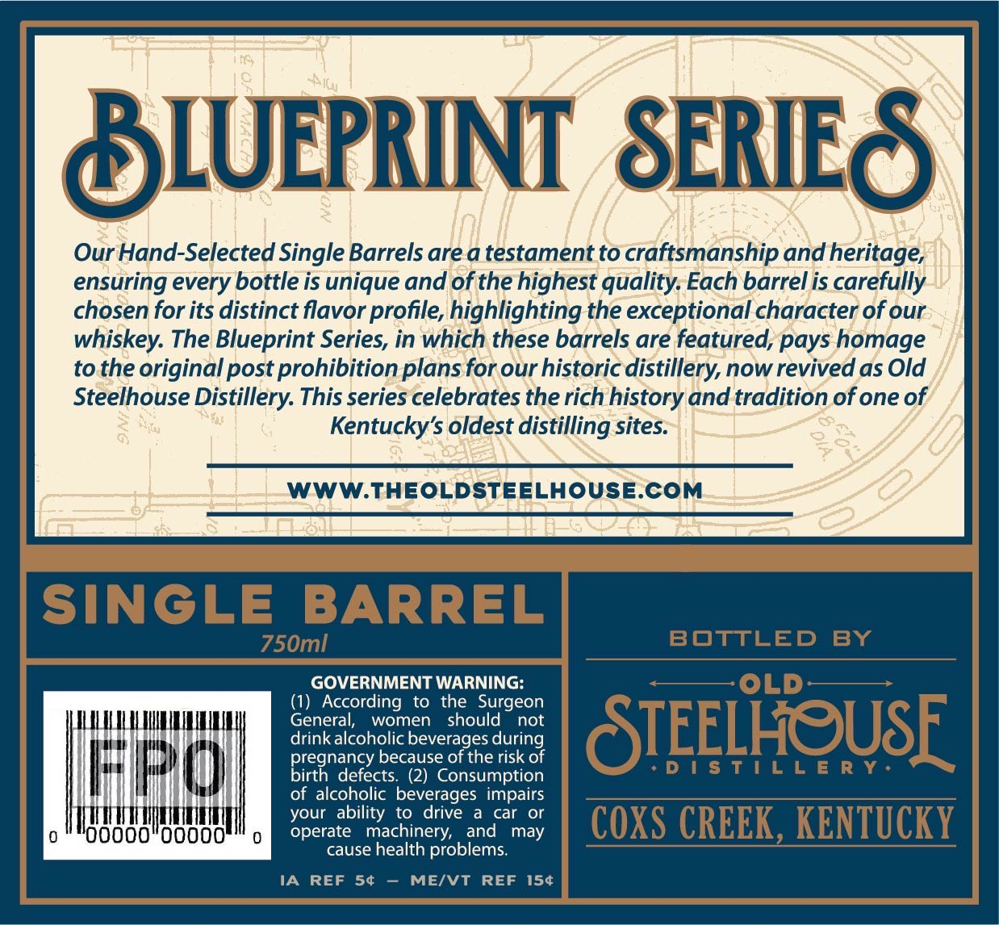
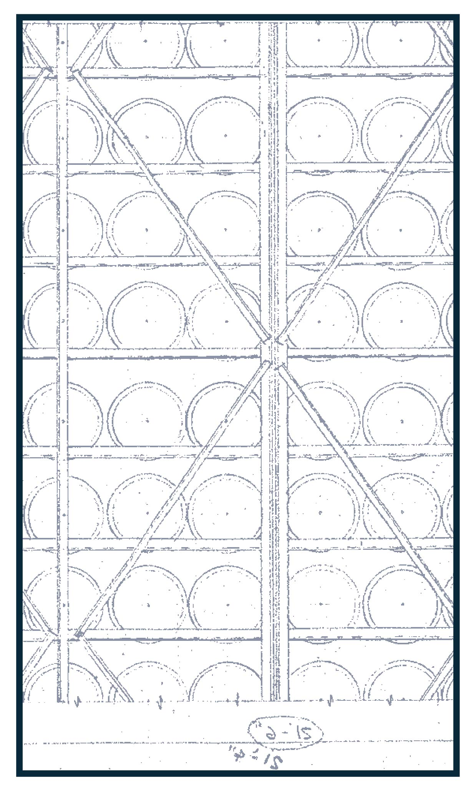
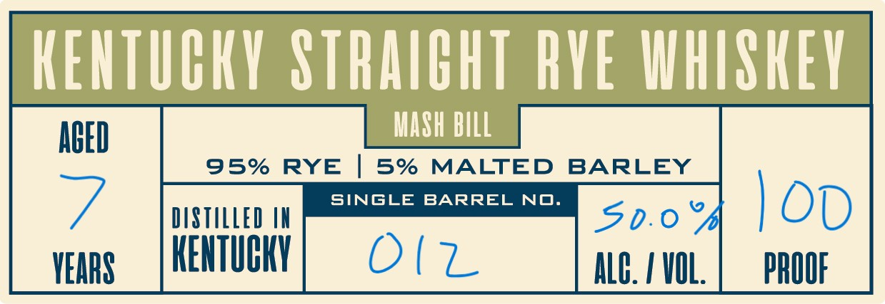

# TTB COLA Label Images - TTBID 26117001000652

**Brand Name:** OLD STELLHOUSE DISTILLERYBLUEPRINT SERIES

**Fanciful Name:** SINGLE BARELL

**Issue Date:** 04/28/2026

**Origin Code:** 22

**Product Class/Type:** 102

**Source:** [TTB Public COLA Registry](https://ttbonline.gov/colasonline/viewColaDetails.do?action=publicFormDisplay&ttbid=26117001000652)

## Label Images

### Back Label

### Front Label

### Label 4

## Extracted Label Text

*Text extracted via OCR - may contain errors*

*1 image(s) excluded: text did not meet readability threshold*

**Detected Proof:** 95

### Back Label

BLUEPRINT  SERIES
Our Hand-Selected Single Barrels are a testament to craftsmanship and heritage,
ensuring every bottle is unique and of the highest quality: Each barrel is carefully
chosen for its distinct flavor profile, highlighting the exceptional character of our
whiskey: The Blueprint Series, in which these barrels are featured, pays homage
to the original post prohibition plans for our historic distillery, now revived as Old
Steelhouse Distillery: This series celebrates the rich history and tradition of one of
Kentucky's oldest distilling sites
WWW:THEOLDSTEELHOUSE.COM
SINGLE
BARREL
750ml
BOTTLED
BY
GOVERNMENT WARNING:
OLD
(1) According
to
the Surgeon
General;
women
should
not
drink alcoholic beverages during
STEELHOUSE
because of the risk of
Hh
Diegnaececbe
(2) Consumption
D ! $ T ! L L E R Y
of alcoholic beverages impairs
your ability to
drive
a car
or
operate
machinery;
and
may
COXS CREEK, KENTUCKY
cause health problems:
IA
REF
54
MEIVT
REF
154

### Label 4

KEHTUCKY STRAIBHT RYE IHISKEV
AGED
MaSh bIlL
95%
RYE
5%
MALTED
BARLEY
SINGLE
BARREL
NO.
OD
DSTILLED IN
5d.0
VEARS
KENTUGKY
0(z
Alk:
VOL
PROOF
