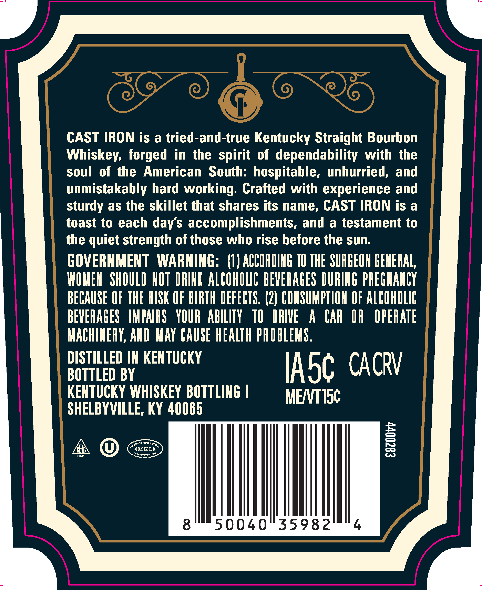
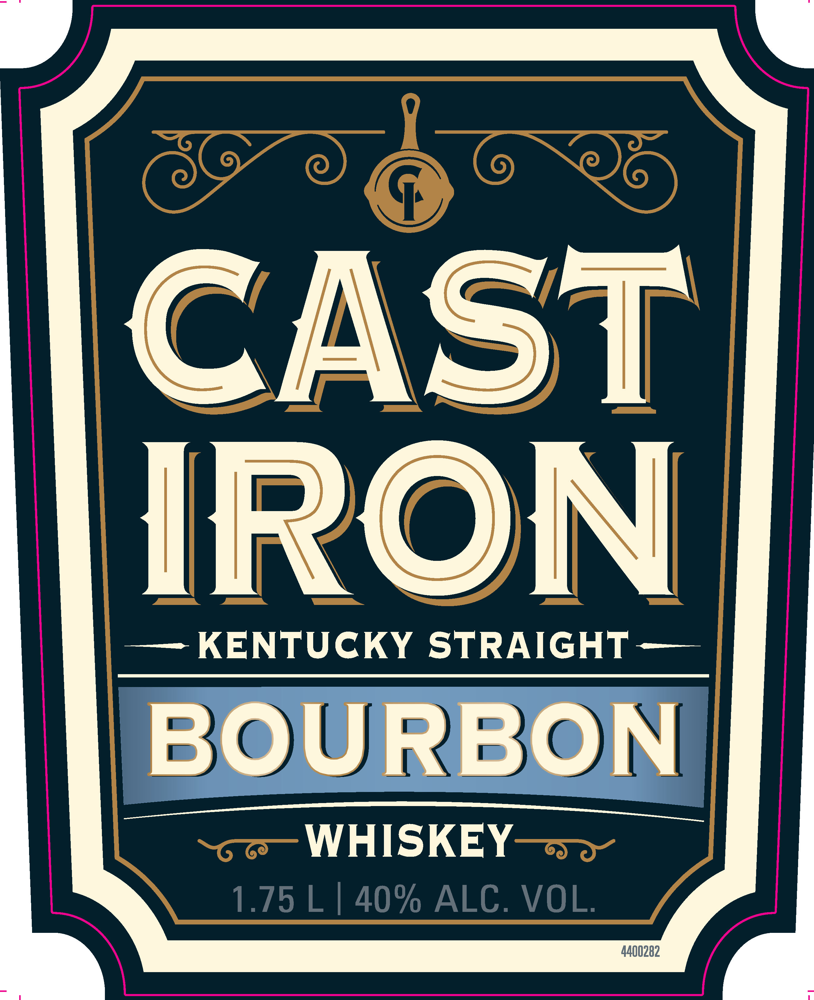

# TTB COLA Label Images - TTBID 26117001000740

**Brand Name:** CAST IRON

**Issue Date:** 04/29/2026

**Origin Code:** 22

**Product Class/Type:** 101

**Source:** [TTB Public COLA Registry](https://ttbonline.gov/colasonline/viewColaDetails.do?action=publicFormDisplay&ttbid=26117001000740)

## Label Images

### Back Label

### Front Label

## Extracted Label Text

*Text extracted via OCR - may contain errors*

*1 image(s) excluded: text did not meet readability threshold*

### Back Label

CAST IRON is a tried-and-true Kentucky Straight Bourbon
Whiskeyz forged
in the spirit of  dependability  with  the
soul
of the American
South: hospitable,  unhurried, and
unmistakably hard working: Cralted with experience and
sturdy as the skillet that shares its name, CAST IRON is a
toast to each days accomplishments, and
a testament to
the quiet strength of those who rise before the sun:
GOVERNMENT  WARNING:   (I) ACCORDIHG TU THE SURGEOH GEHERAL,
WOMEH   SHOULD HOT  DRIHK ALCOHOLIC BEVERAGES DURIHG PREGHAHCY
BECAUSE UF THE RISK OF BIRTH DEFECTS. (2) COHSUMPTIOH OF ALCOHOLIC
BEVERAGES   IMPAIRS   YOUR  AbILITY
TO  DRIVE
A
CAR
OR
OPERATE
MACHIHERY, AHD  MAY CAUSE HEALTH PROBLEMS:
DISTILLED IN KENTUCKY
CACRV
BOTTLED BY
IAsc
KENTUCKY WHISKEY BOTTLING |
MENT 15c
SHELBYVILLE, KY 40065
AMKLB
1
362
#itpphtstat
8
50040'
35982
Kiab
Msypd
