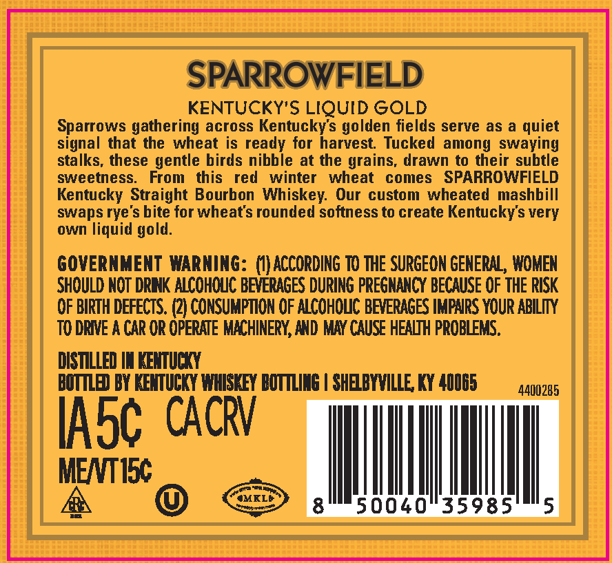
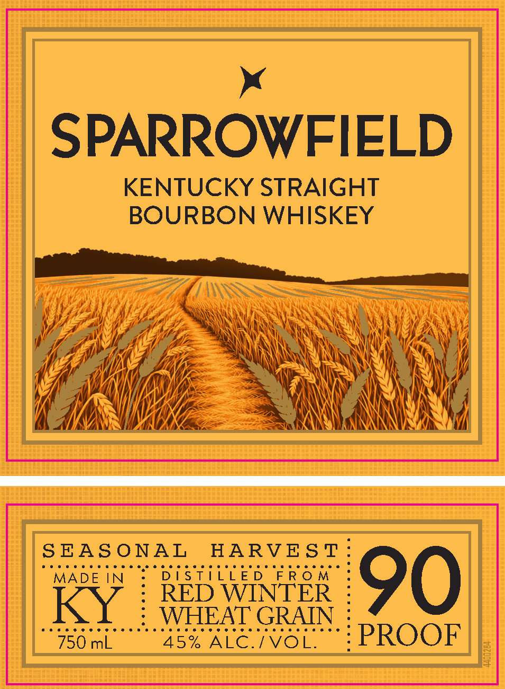
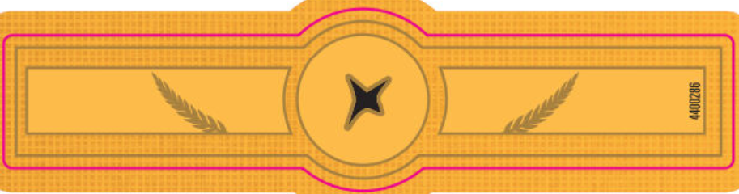

# TTB COLA Label Images - TTBID 26117001000742

**Brand Name:** SPARROWFIELD

**Issue Date:** 05/01/2026

**Origin Code:** 22

**Product Class/Type:** 101

**Source:** [TTB Public COLA Registry](https://ttbonline.gov/colasonline/viewColaDetails.do?action=publicFormDisplay&ttbid=26117001000742)

## Label Images

### Back Label

### Front Label

### Label 2

## Extracted Label Text

*Text extracted via OCR - may contain errors*

*1 image(s) excluded: text did not meet readability threshold*

### Back Label

SPARROWFIELD
KENTUCKY'S LIQUID GOLD
Sparrows gathering across Kentuckys golden fields serve as
quiet
signal that the
wheat is ready for harvest
Tucked among swaying
stalks, these gentle birds nibble at the grains, drawn to their subtle
sweetness:
From
this
red
winter
wheat
comes
SPARROWFIELD
Kentucky Straight Bourbon Whiskey:  Our
custom wheated
mashbill
swaps rye's bite for wheat's rounded softness to create Kentuckys very
own liquid gold.
GOVERNMENT WARNING: ()ACCORDING TO THE SURGEON GENERAL , WOMEN
SHOuld NOT DRNK ALCOhCuc BEVERAGES DURING PREGNANCY BECAUSE OF THE RISK
OF BIRTH DEFECTS. (2) CONSUMPTION OF ALCOHOUC BEVERAGES IMPNRS YOUR ABILIN
TO DRIVE A CAR OR OPERATE MKCHINERY, AND MAY CAUSE HEALITH PROBLEMS.
DISTILLED IN KEMUCKY
BOTLED BY KEMTUCKY WHISKEY BOTTLING | SHEBYVILLE KY 40065
4400285
IASc CACRV
MENTISC
JMKLA
Lntlti_
50040
35985
5

### Front Label

SPARROWFIELD

KENTUCKY STRAIGHT

BOURBON WHISKEY

en

4

‘i

\

As:\

VAN

Nat

\

iA

fi

pogoo po DG Roagpo RD RR aOR GARE ogo O Re BORO

SEASONAL HARVEST

MADE IN

DISTILLED

KY : #2 ear WINTER

90

750 mL

we TNE PSN

PROOF
