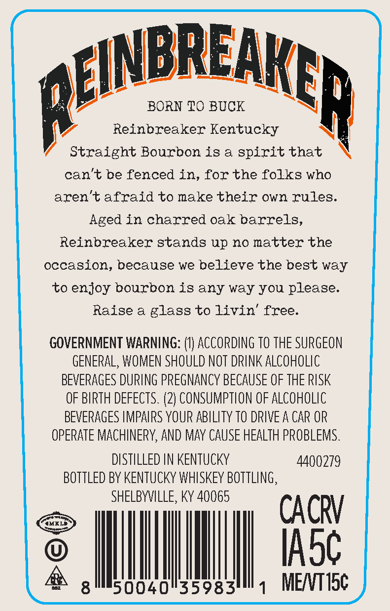
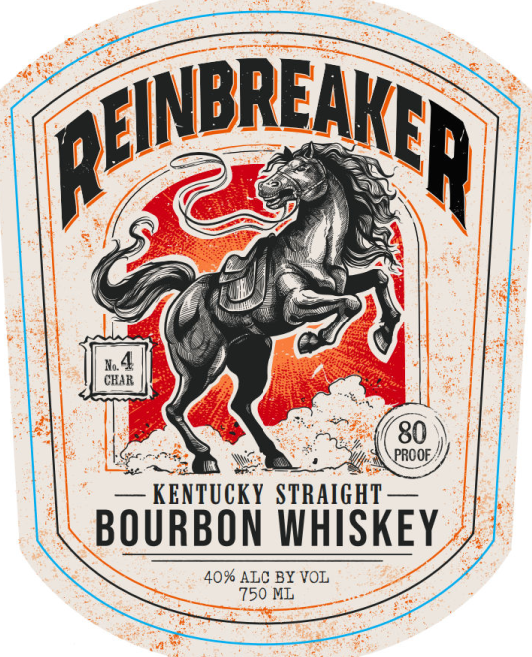

# TTB COLA Label Images - TTBID 26117001000743

**Brand Name:** REINBREAKER

**Issue Date:** 04/30/2026

**Origin Code:** 22

**Product Class/Type:** 101

**Source:** [TTB Public COLA Registry](https://ttbonline.gov/colasonline/viewColaDetails.do?action=publicFormDisplay&ttbid=26117001000743)

## Label Images

### Back Label

### Front Label

## Extracted Label Text

*Text extracted via OCR - may contain errors*

**Detected Proof:** 80

### Back Label

BREAK

gen

BORN TO BUCK

Reinbreaker Kentucky

" seatient Bourbon is a spirit that NX

can’t be fenced in, for the folks who

aren’t afraid to make their own rules,

Aged in charred oak barrels,

Reinbreaker stands up no matter the

occasion, because we believe the best way

to enjoy bourbon is any way you please

Raise a glass to livin’ free

GOVERNMENT WARNING: (1) ACCORDING T0 THE SURGEON

GENERAL, WOMEN SHOULD NOT DRINK ALCOHOLIC

BEVERAGES DURING PREGNANCY BECAUSE OF THE RISK

OF BIRTH DEFECTS. (2) CONSUMPTION OF ALCOHOLIC

BEVERAGES IMPAIRS YOUR ABILITY 10 DRIVE A CAR OR

OPERATE MACHINERY, AND MAY CAUSE HEALTH PROBLEMS.

DISTILLED IN KENTUCKY

4400279

BOTTLED BY KENTUCKY WHISKEY BOTTLING

SHELBYVILLE, KY 40065

CACRV

ASG

|

|

0040°35983

ME/VT15¢

### Front Label

QFNBRENp
CHAR
80
PROOE
KENTUCKY STRAIGHT
BOURBON WHISKEY
40% ALC BY VOL
750 ML
