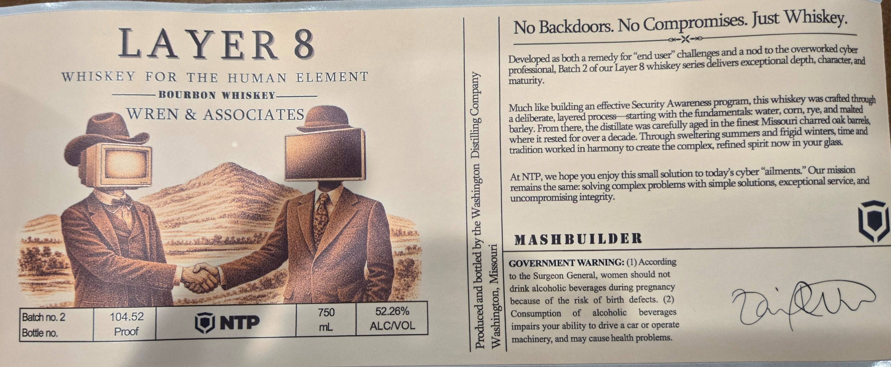

# TTB COLA Label Images - TTBID 26117001000778

**Brand Name:** LAYER 8

**Issue Date:** 04/29/2026

**Origin Code:** 29

**Product Class/Type:** 141

**Source:** [TTB Public COLA Registry](https://ttbonline.gov/colasonline/viewColaDetails.do?action=publicFormDisplay&ttbid=26117001000778)

## Label Images

### Label 1

## Extracted Label Text

*Text extracted via OCR - may contain errors*

**Detected Proof:** 104.5

### Label 1

No Backdoors No
Compromises Just Whiskey:
G
LAYER 8
for
((
end=
challengesand a nod tothe Overworked cyber_
Developed as both a remedy
series delivers
depth, character;and
professional, Batch 2 ofour Layer 8 whiskey
WHISKEY
FOR
THE
HUMAN
ELEMENT
maturity:
BOURBON
WHISKEY
J
effective Security Awareness program this whiskey was crafed through
WREN & ASSOCIATES
Much like buildingan
with the fundamentals: water; COrL,rye, and malted
a
deliberate; layered process
starting
in the finest Missouri charred oak barreks
barley From there; the distillate was carefully
summers and frigid winters time and
[
wbere t rested fo5 Over a decade CTeare e coreipieingetnedspiri Owg yorghsu
tradition worked in harmony to create the
complex
AtNTP, we hope you enjoy this small sohition to todays cyber
aiments:
Our mission
remains the same:
solving complex problems with simple solutions
service, and
L
uncompromising integrity.
4
MASHBUILDER
J]
GOVERNMENT WARNING: (1) According
to the Surgeon General, women should not
drink alcoholic beverages during pregnancy
1
because of the risk of birth   defects. (2)
QA
Batch no. 2
104.52
750
52.26%
H
Consumption
of
alcoholic
beverages
NTP
mL
ALCNOL
1
impairs your ability to drive & car or operate
Bottle no:
Proof
machinery, and may cause health problems:
user"
exceptional
aged
exceptional
