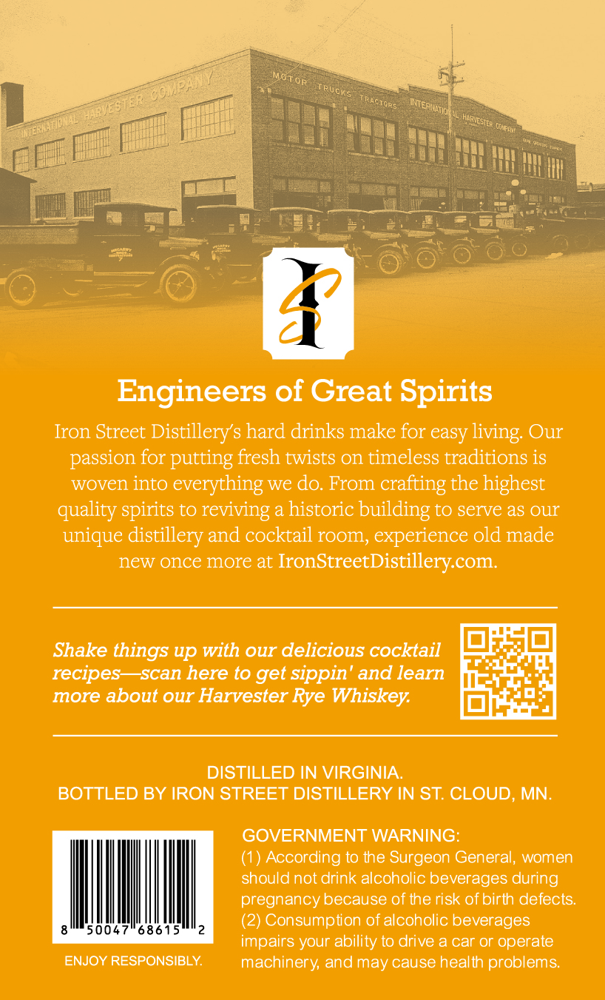
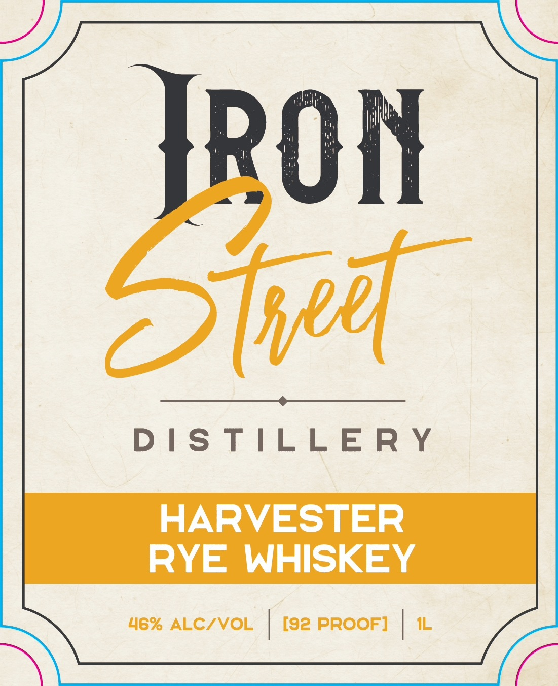

# TTB COLA Label Images - TTBID 26117001000860

**Brand Name:** HARVESTER RYE WHISKEY

**Issue Date:** 04/29/2026

**Origin Code:** 27

**Product Class/Type:** 142

**Source:** [TTB Public COLA Registry](https://ttbonline.gov/colasonline/viewColaDetails.do?action=publicFormDisplay&ttbid=26117001000860)

## Label Images

### Back Label

### Label 1

## Extracted Label Text

*Text extracted via OCR - may contain errors*

### Back Label

Engineers of Great Spirits
Iron Street Distillerys hard drinks make for easy
Our
passion for putting fresh twists on timeless traditions is
woven into everything we do: From
crafting the highest
quality spirits to reviving a historic building to serve as our
unique distillery and cocktail room, experience old made
new once more at
IronStreetDistillerycom:
Shake things up with our delicious cocktail
recipes
scan here t0 get sippin' and learn
more about our Harvester Rye Whiskey:
DISTILLED IN VIRGINIA
BOTTLED BY IRON STREET DISTILLERY IN ST: CLOUD; MN:
GOVERNMENT WARNING:
According t0 the Surgeon General; women
should not drink alcoholic beverages during
pregnancy because of the risk of birth defects:
(2) Consumption of alcoholic beverages
impairs your ability t0 drive a car or operate
ENJOY RESPONSIBLY
machinery; and may cause health problems:
living:

### Label 1

On

el

DISTILLERY

HARVESTER

RYE WHISKEY

Soe
