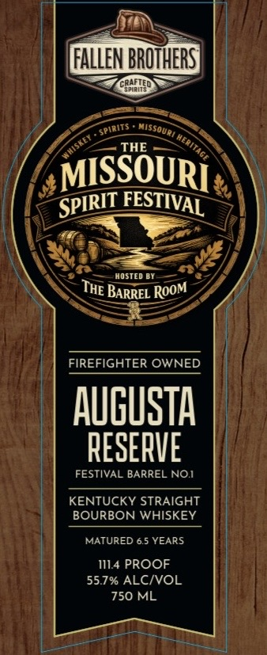
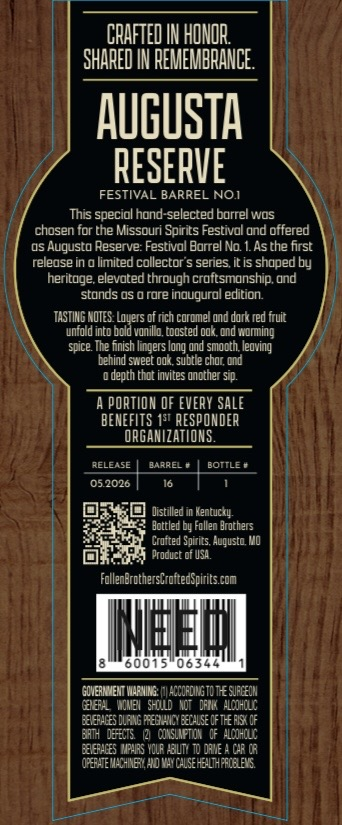
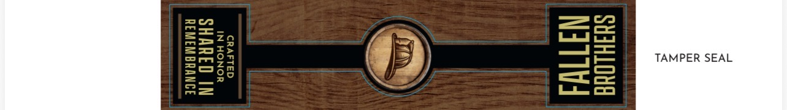

# TTB COLA Label Images - TTBID 26117001000912

**Brand Name:** FALLEN BROTHERS CRAFTED SPIRITS

**Fanciful Name:** AUGUSTA RESERVE: FESTIVAL BARREL NO.1

**Issue Date:** 04/29/2026

**Origin Code:** 29

**Product Class/Type:** 101

**Source:** [TTB Public COLA Registry](https://ttbonline.gov/colasonline/viewColaDetails.do?action=publicFormDisplay&ttbid=26117001000912)

## Label Images

### Label 1

### Label 2

### Label 3

## Extracted Label Text

*Text extracted via OCR - may contain errors*

*1 image(s) excluded: text did not meet readability threshold*

**Detected Proof:** 114
**Detected Age:** 6.5 Years

### Label 1

FAlLeN BROTHERS]
THE
MISSOURI
HOSTED BY
FIREFIGHTER OWNED
auguSta
RESERVE
FESTIVAL BARREL NOI
KENTUCKY STRAIGHT
BOURBON WHISKEY
MATURED 6.5 YEARS
1114 PROOF
55.7% ALCIVOL
750 ML
~spirits
Missquai
meritage
FESTIVAL
SPIRIT
THE
Room
BARREL

### Label 2

CRAFTED IN HONOR
SHARED IN REMEMBRANCE
AugUSTA
RESERVE
FESTIVAL BARREL NOI
This speciol hond-selected borrel wos
chosen for the Missouri Spirits Festival und offered
0s Augusto Reserve: Festivol Borrel No
Asthe first
releosein
limited collector"
series it is shoped by
heritage elevoted through croftsmonship ond
stonds 0S
rore inougurol edition
TASTIHG HOTES
Dodes
oftich coromel ond dark red iruit
untold into E
vanillo toosted @ok.@nd Woning
spice Ihe fnish lingers long und sniocth ledving
Lehind sweet odk.subtle chor @nd
depth thot invites unctner Sip.
PORTION @F EveRY sale
BENEFLTS 1s RESPONDER
ORGANIZATIONS.
RELEASE
@arREL
BOTTLE *
05.2026
Distilled [
Henbucky:
Hottled Dy Follen Drochers
Crutte d Spirits.Huqusto Wo
Product @f WSA
FollenbrghersGroiledspities com
MEM
06347
GQVEARMEHT HueIZ'
ACCOFCIIGTO Te Sufleuh
6IEF
HCMBI^ chCllld
DFI
HLOThCLC
Felefhces DLeLG PeghCy Eecalse Df Te Fu5I DF
Eh DFElts
QTYCLAfT_I
FLOUhCLL
Fneehces MRS YCLF FolTt
dae
GF (A}
uefhEW CLEX HO My Glseteuheflelele
