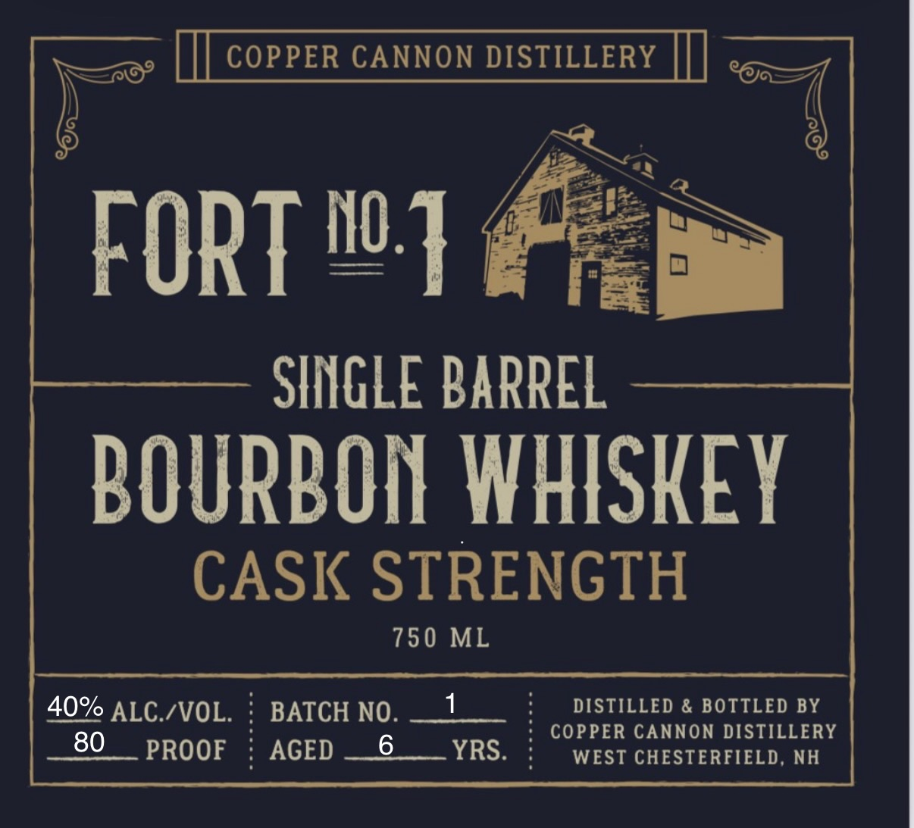
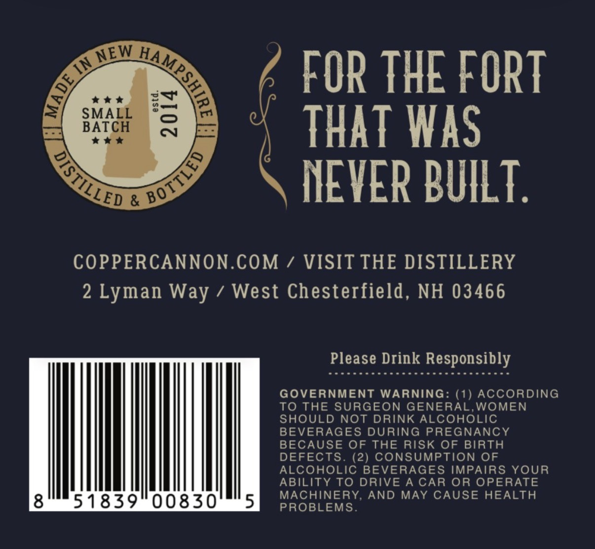

# TTB COLA Label Images - TTBID 26118001000001

**Brand Name:** FORT NO. 1

**Issue Date:** 04/29/2026

**Origin Code:** 33

**Product Class/Type:** 141

**Source:** [TTB Public COLA Registry](https://ttbonline.gov/colasonline/viewColaDetails.do?action=publicFormDisplay&ttbid=26118001000001)

## Label Images

### Label 1

### Label 2

## Extracted Label Text

*Text extracted via OCR - may contain errors*

**Detected Proof:** 80

### Label 1

COPPER CANNON DISTILLERY
FORT no:]
SINGLE BARREL
BOURBON WHISKEY
CASK STRENGTH
750 ML
40% ALC IVOL_
BATCH NO_
1
DISTILLED & BOTTLED BY
80
6
COPPER CANNON DISTILLERY
PROOF
AGED
YRS
WEST CHESTERFIELD,
NH

### Label 2

^
FOR THE FORT
Fa
:
SMfCH
8
THAT WaS
&
NEVER BUILT .
COPPERCANNON.COM / VISIT THE DISTILLERY
2 Lyman
1
West Chesterfield, NH 03466
Please Drink Responsibly
GOVERNMENT WARNING: (1) ACCORDING
To THE SURGEON GENERAL
WOMEN
SHOULD NOT
DRINK ALCOHOLIC
BEVERAGES DURING
PREGNANCY
BECAUSE OF
THE RISK OF
BIRTH
DEFECTS
(2) CONSUMPTION OF
ALCOHOLIC BEVERAGES IMPAIRS YOUR
ABILITY
DRIVE A CAR OR OPERATE
8
51839
00830
5
MACHINERY, AND
MAY CAUSE HEALTH
PROBLEMS_
NEW
AAMShIRE_
3=
BoTTLED
DISTILLED
Way
To
