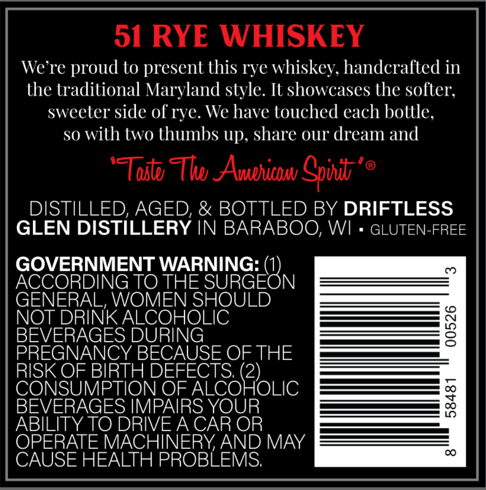
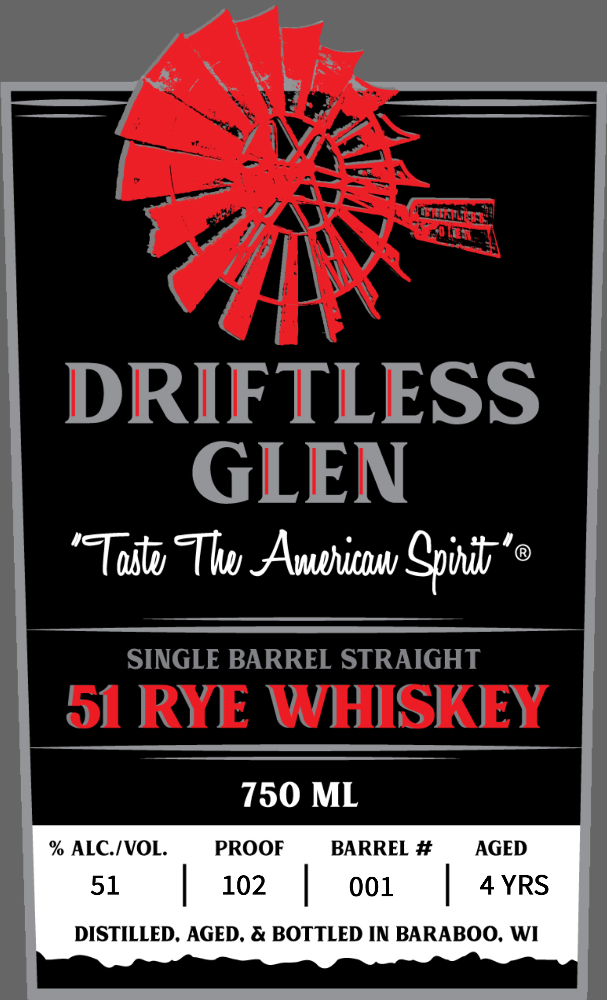

# TTB COLA Label Images - TTBID 26118001000120

**Brand Name:** DRIFTLESS GLEN

**Issue Date:** 04/30/2026

**Origin Code:** 48

**Product Class/Type:** 102

**Source:** [TTB Public COLA Registry](https://ttbonline.gov/colasonline/viewColaDetails.do?action=publicFormDisplay&ttbid=26118001000120)

## Label Images

### Back Label

### Front Label

## Extracted Label Text

*Text extracted via OCR - may contain errors*

**Detected Age:** 4 Years

### Back Label

o1 RYE WHISKEY

We're proud to present this rye whiskey, handcrafted in

he traditional Maryland style. It showcases the softer

sweeter side of rye. We have touched each bottle

so with two thumbs up, share our dream and

Toit Tho American Spirit ’®

DISTILLED, AGED, & BOTTLED BY DRIFTLESS

GLEN DISTILLERY IN BARABOO, W!

GLUTEN-FREE

GOVERNMENT WARNING: (

ACCORDING TO THE SURGE N

GENERAL, WOMEN SHOULD

NOT DRINK ALCOHOLIC

BEVERAGE

PREGNANCY BECAUSE OF THE

RISK OF BIRTH DEFEC

O

U

|

N OF ALCO

2)

OLIC

BEVERAGES IMPAIRS YOUR

ABILITY TO DRIVE A CAR OR

OPERATE MACHINERY, AND MAY

CAUSE HEALTH PROBLEMS

### Front Label

DRIFTLESS
GLEN
'Tostv Tlwu AAvahinu Cpvdv'
SINGLE BARREL STRAIGHT
51 RYE
WHISKEY
750 ML
% ALCIVOL.
PROOF
BARREL #
AGED
51
102
001
4 YRS
DISTILLED, AGED. & BOTTLED IN BARABOO; WI
THH
