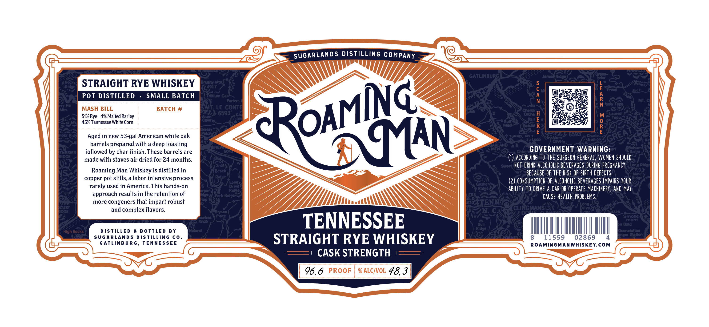

# TTB COLA Label Images - TTBID 26118001000123

**Brand Name:** ROAMING MAN

**Fanciful Name:** CASK STRENGTH

**Issue Date:** 04/30/2026

**Origin Code:** 43

**Product Class/Type:** 102

**Source:** [TTB Public COLA Registry](https://ttbonline.gov/colasonline/viewColaDetails.do?action=publicFormDisplay&ttbid=26118001000123)

## Label Images

### Label 1

## Extracted Label Text

*Text extracted via OCR - may contain errors*

### Label 1

SUGARLANDS DISTILLING COMPANY
GATLINBURG
Roeny
STRAIGHT RYE WHISKEY
JnW
Ridge
POT DISTILLED
SMALL BATCH
rnln Gap'
1
1
Bueh
Porters
Mt
Men -
MASH BILL
BATCH #
LE CONTE
8
4
Can
TEE) 6593'
Orch
H
51% Rye   4% Malted
Vm
0
E
45% Tennessee White Corn
R
R
E
E
nber
Aged in new 53-gal American white oak
MAN
TurnEL
d
F
Nom
0595
Guarlon?
barrels prepared with a deep toasting
NEI
JATLAND
ENbrIER
followed by char finish: These barrels are
504
Calmi
GOVERNMENT WARNING=
Risge1
ridGe
made with staves air dried for 24 months
ACCORDIHG TO The SURGEOh GENErAL, WOMEN ShoulD
Shot
NOT  DRINK alCohOLIc beverages DuRING Preghancy
Long
Ridge
NS
Roaming Man Whiskey is distilled in
Beach
BECAuse OF thE RISK  OF BIRTh defects.
Mine =
copper
stills,a labor intensive process
Ridge `
(2) COHSUMPTIOH OF ALCOHOLIC BEVERAGES IMPAIRS YOUR %oge;
Longe
Goshen
rarely used in America This hands-on
Drivas
Ridge
AbiLITy TO DRIVE A CAR OR Operate MAChIERY, AND May
Ridge
approach results in the retention of
Fork Ridgar
Ers
CAUSE health PROBLEMS.
L'
ALD
more congeners that impart robust
520
TENN:
Long
IOGET
and complex flavors
CLINGMANS
Drive?
Iskee
Bryson
Place
Smoke
K',
TENNESSEE
Suli
Uh Banont
High Rocks
DISTLLED
B OTTLED
B Y
Vid
Ridge
Oeenaluiea
SUGARLANDs
DISTLLING
C0
STRAIGHT RYE WHISKEY
8
11559
02869
S
G ATLINBURG
TENNESSEE
ROAMINGMANWHISKEY.COM
CASK STRENGTH
96,6
PROOF
% ALCIVOL 48,3
Ramsoy
RoAMNG
4491l"
Barley
GREAT
MIIIIIIIIIIIIIIIIIIIIL
18
pot
