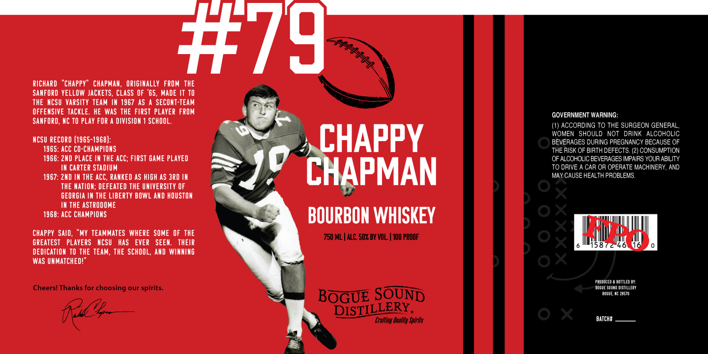

# TTB COLA Label Images - TTBID 26118001000125

**Brand Name:** CHAPPY CHAPMAN BOURBON WHISKEY BOGUE SOUND DISTILLERY

**Issue Date:** 04/30/2026

**Origin Code:** 35

**Product Class/Type:** 141

**Source:** [TTB Public COLA Registry](https://ttbonline.gov/colasonline/viewColaDetails.do?action=publicFormDisplay&ttbid=26118001000125)

## Label Images

### Label 1

## Extracted Label Text

*Text extracted via OCR - may contain errors*

**Detected Proof:** 100

### Label 1

#79
RIchard
'chappy" chAPMan
origimalLy FROM THE
SANFORD YELLOW JACKETS, CLASS OF '65, MADE IT TO
THE NCSU VarSiTy TEAM IK 1967 AS A SECONT-TEAM
OFFENSIVE TACKLE . HE WaS THE FIRST PLAYER FROM
GOVERNMENT WARNING:
SANFORD, NC TO PLAY FOR
DIVISION
SCHOOL.
(1) ACCORDING TO THE SURGEON GENERAL
WOMEN SHOULD NOT DRINK ALCOHOLIC
NCSU RECORD (1965-1968)
CHAPPY
BEVERAGES DURING PREGNANCY BECAUSE OF
1965: ACC CO-CHAMPIONS
THE RISK OF BIRTH DEFECTS. (2) CONSUMPTION
1966: ZMD PLACE IK THE AcC; FIRST GAME PLAYED
OF ALCOHOLIC BEVERAGES IMPAIRS YOUR ABILITY
IN CARTER STADIUM
CHAPMAN
TO DRIVE
CAR OR OPERATE MACHINERY, AND
1967: ZND IN THE ACC, RANKED AS HIGH AS JRD IH
MAY CAUSE HEALTH PROBLEMS
THE HATION; DEFEATED THE UNIVERSITY OF
GEORGIA IN THE LIBERTY BOWL AND HOUSTOH
IN THE ASTRODOME
1968: ACC CHAMPIOHS
BOURBON WHISKEY
chappy  SAID,
"MY TEAMMATES WHERE SOME OF THE
750 ML | ALC: 50% BY VOL | 100 PROOF
3
GREATEST   PLAYERS   NCSU   HaS   EVER   SEEN:
THEIR
15872
DEDICATION TO THE TEAM, THE SCHOOL, AND WINNING
WaS UNMATCHED!
PRu DUcEO
pottleo DY:
Cheers! Thanks for choosing our spirits_
EogueeJuad DISTILLEPY
BOGUE SQUND
Oogue
28570
DISTILLERY;
Cralling Uualily Spirits
BATCH#
AFFFHH_
