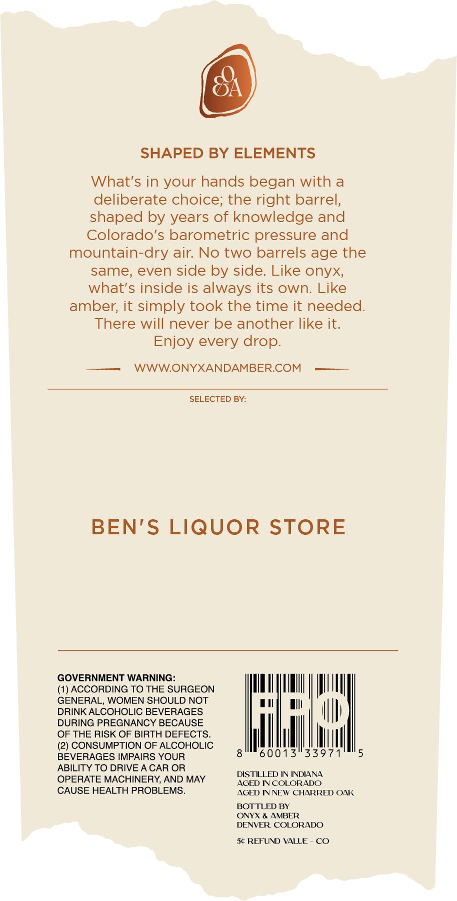

# TTB COLA Label Images - TTBID 26118001000189

**Brand Name:** ONYX AND AMBER

**Fanciful Name:** SINGLE BARREL FORMATION RYE

**Issue Date:** 05/01/2026

**Origin Code:** 13

**Product Class/Type:** 102

**Source:** [TTB Public COLA Registry](https://ttbonline.gov/colasonline/viewColaDetails.do?action=publicFormDisplay&ttbid=26118001000189)

## Label Images

### Front Label

## Extracted Label Text

*Text extracted via OCR - may contain errors*

### Front Label

SHAPED BY ELEMENTS
What's in your hands began with a
deliberate choice; the right barrel,
shaped by years of knowledge and
Colorado's barometric pressure and
mountain-dry air: No two barrels age the
same; even side by side. Like onyx;
what's inside is always its own: Like
amber; it simply took the time it needed:
There will never be another like it:
Enjoy every drop.
WWWONYXANDAMBERCOM
SELECTED BY:
BEN'S
LIQUOR STORE
GOVERNMENT WARNING:
ACCORDING TO THE SURGEON
GENERAL; WOMEN SHOULD NOT
DRINK ALCOHOLIC BEVERAGES
DURING PREGNANCY BECAUSE
OF THE RISK OF BIRTH DEFECTS_
'2) CONSUMPTION OF ALCOHOLIC
BEVERAGES IMPAIRS YOUR
0013"33971
ABILITY TO DRIVE A CAR OR
DISTILLED IN INDIANA
OPERATE MACHINERY AND MAY
AGED IN COLORADO
CAUSE HEALTH PROBLEMS_
AGED IN NEW CHARRED OAK
BOTTLED BY
ONYX & AMBER
DENVER COLORADO
5c REFUND VALUE
CO
