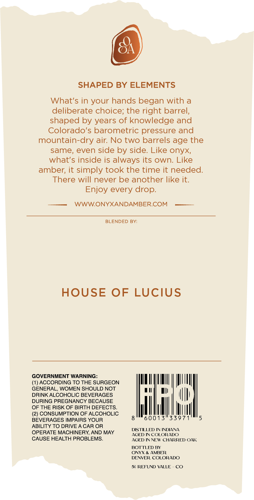
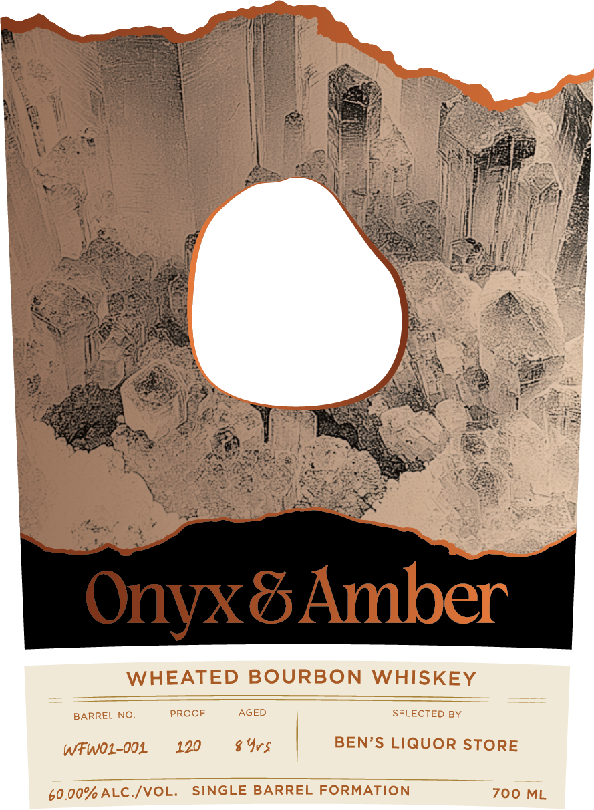

# TTB COLA Label Images - TTBID 26118001000193

**Brand Name:** ONYX AND AMBER

**Fanciful Name:** SINGLE BARREL FORMATION WHEATED BOURBON

**Issue Date:** 05/04/2026

**Origin Code:** 13

**Product Class/Type:** 141

**Source:** [TTB Public COLA Registry](https://ttbonline.gov/colasonline/viewColaDetails.do?action=publicFormDisplay&ttbid=26118001000193)

## Label Images

### Back Label

### Front Label

## Extracted Label Text

*Text extracted via OCR - may contain errors*

### Back Label

SHAPED BY ELEMENTS
What's in your hands began with a
deliberate choice; the right barrel,
shaped by years of knowledge and
Colorado's barometric pressure and
mountain-dry air: No two barrels age the
same; even side by side. Like onyx;
what's inside is always its own: Like
amber; it simply took the time it needed:
There will never be another like it:
Enjoy every drop.
WWWONYXANDAMBERCOM
BLENDED BY:
HOUSE OF LUCIUS
GOVERNMENT WARNING:
ACCORDING TO THE SURGEON
GENERAL; WOMEN SHOULD NOT
DRINK ALCOHOLIC BEVERAGES
DURING PREGNANCY BECAUSE
OF THE RISK OF BIRTH DEFECTS_
'2) CONSUMPTION OF ALCOHOLIC
BEVERAGES IMPAIRS YOUR
0013"33971
ABILITY TO DRIVE A CAR OR
DISTILLED IN INDIANA
OPERATE MACHINERY AND MAY
AGED IN COLORADO
CAUSE HEALTH PROBLEMS_
AGED IN NEW CHARRED OAK
BOTTLED BY
ONYX & AMBER
DENVER COLORADO
5c REFUND VALUE
CO

### Front Label

Pere |,
YT See
Oe lh lel ks
Vere ae 7 se
\ WY Se i ee  N. Moe.
BN acres ee St NEE hh Ree.
a \ Son nM ale : NES KF
Ra : Me segeeN Soe Hoc). NEN ors
eee Fa ae | See
Bete) <5 Ve iS Hay Na
ale, Nea Gs eae ee) he HE eau
ei ee 4 (poicaen, «(fl ya ba ster
‘Ve : Ces eats il RepeE
Ven eee eg aie Se 25) Hote ig ity Su
ey Coen Re! e q
Oe al aie Gr a ee
Ei RE eS - Re
ABE een oe? wad
EON Bat Vor
Wes con ga A aS
Kido: EC, iba ESB ce &
Saas DP. Ors ee Ke Bata,
Bo, ne i eS an Wee Gane 4
ee} a We Eats! ES cN :* ke) ee
1 Fe Raa aes he fs ee see
ed EN PBB Oe
\ eae Mae a fei ox : Sas tS
A eee A A ‘4 Be OS ae i=
|i Gaara Cpa éy Fay Hy ‘i a3 eee em iS
. poe eH AS. RT Te Bae Ram he. Ce a
' a8 ‘ 0 rR Re ia 8 SRS
ONS ORG EY SOS EE SoS <
| Ne ee eee os
Tei See fs so See 2
| Ven +) es
4 3
