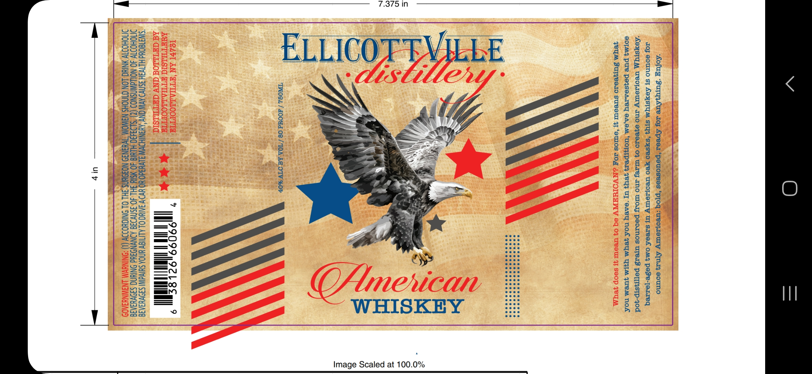

# TTB COLA Label Images - TTBID 26118001000197

**Brand Name:** ELLICOTTVILLE DISTILLERY

**Issue Date:** 04/30/2026

**Origin Code:** 02

**Product Class/Type:** 140

**Source:** [TTB Public COLA Registry](https://ttbonline.gov/colasonline/viewColaDetails.do?action=publicFormDisplay&ttbid=26118001000197)

## Label Images

### Label 1

## Extracted Label Text

*Text extracted via OCR - may contain errors*

### Label 1

SCAN
fofug ‘sur fue Loy Seo Na see prog : Seeoeury ATN.1y souno
doy soUNO st LOYSTUM STUY ‘SysSeo Weo weosoury ul sueek Om} pose-jorreq
AOYSTUM Weojloury Ino 998820 09 Ulaeyl INO WOdy poornos ureds poeTitstp-jod
e0T4 pure PeysoATeY OA,OM ‘TOMTpea yey UT ‘“eaeY NOL Vey M UIT JUeM NOL
qeumM Suyyeeso sueour 4 ‘eulos Jog ENVOIMAINV 8d 03 Weour yt seop yeUM

Togs /AO0td 08 / TON AROTY SOV Pa)
&

Ill
AG GHILLOG CNY GHTMLISIC biaeead

“SWATGO'd HLTV3H ISNV) AVW CNY AYINIHOIN ALVUadO NO Uv IAINCOL ALITICN UNOA SUivdlWI S3OVURAgG
DNOHODIV: 40 NOLAWNSNOD (2) LDA C-HIUIG 40 Sit 3H 40.3SNVI9G AINYNDSHd ONTUNG S39VUIAIG
DNOHOD NIC 1ON CTAOHS i eaN29 i 498 DUNS : SHI OL SNIGHOIY. (1) DNINUVM ANAWNU3A09

Image Scaled at 100.0%
