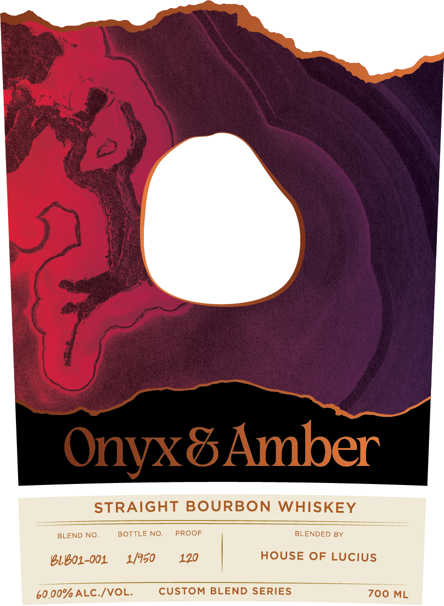

# TTB COLA Label Images - TTBID 26118001000200

**Brand Name:** ONYX AND AMBER

**Issue Date:** 05/04/2026

**Origin Code:** 13

**Product Class/Type:** 101

**Source:** [TTB Public COLA Registry](https://ttbonline.gov/colasonline/viewColaDetails.do?action=publicFormDisplay&ttbid=26118001000200)

## Label Images

### Back Label

### Front Label

## Extracted Label Text

*Text extracted via OCR - may contain errors*

**Detected Proof:** 120

### Back Label

SHAPED BY ELEMENTS
What's in your hands began with a
deliberate choice; the right barrel,
shaped by years of knowledge and
Colorado's barometric pressure and
mountain-dry air: No two barrels age the
same; even side by side. Like onyx;
what's inside is always its own: Like
amber; it simply took the time it needed:
There will never be another like it:
Enjoy every drop.
WWWONYXANDAMBERCOM
BLENDED BY:
HOUSE OF LUCIUS
GOVERNMENT WARNING:
ACCORDING TO THE SURGEON
GENERAL; WOMEN SHOULD NOT
DRINK ALCOHOLIC BEVERAGES
DURING PREGNANCY BECAUSE
OF THE RISK OF BIRTH DEFECTS_
'2) CONSUMPTION OF ALCOHOLIC
BEVERAGES IMPAIRS YOUR
0013"33971
ABILITY TO DRIVE A CAR OR
DISTILLED IN INDIANA
OPERATE MACHINERY AND MAY
AGED IN COLORADO
CAUSE HEALTH PROBLEMS_
AGED IN NEW CHARRED OAK
BOTTLED BY
ONYX & AMBER
DENVER COLORADO
5c REFUND VALUE
CO

### Front Label

Onyx&Amber
STRAIGHT BOURBON WHISKEY
BLEND NO
BOTTLE
NO;
PROOF
BLENDED BY
31e01-001
1/950
120
HOUSE OF LUCiUs
60.00% ALC /VOL.
CUSTOM BLEND SERIES
700 ML
