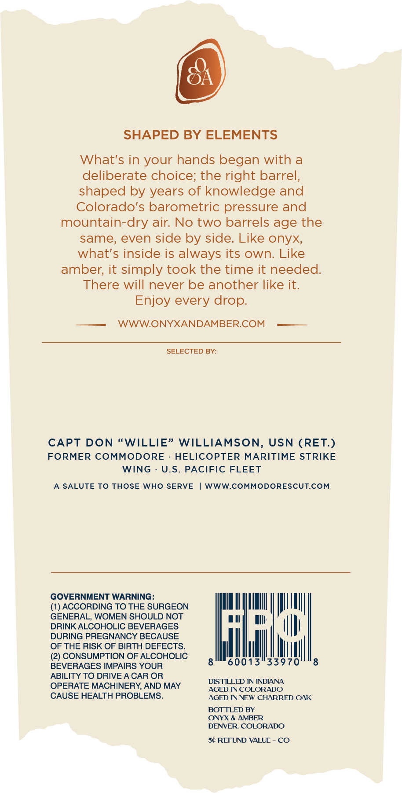
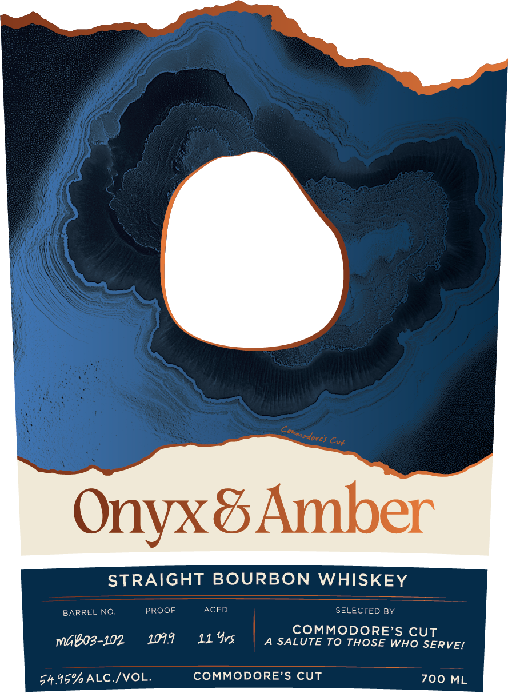

# TTB COLA Label Images - TTBID 26118001000205

**Brand Name:** ONYX AND AMBER

**Fanciful Name:** COMMODORES CUT

**Issue Date:** 05/04/2026

**Origin Code:** 13

**Product Class/Type:** 101

**Source:** [TTB Public COLA Registry](https://ttbonline.gov/colasonline/viewColaDetails.do?action=publicFormDisplay&ttbid=26118001000205)

## Label Images

### Back Label

### Front Label

## Extracted Label Text

*Text extracted via OCR - may contain errors*

**Detected Proof:** 109.9

### Back Label

SHAPED BY ELEMENTS
What's in your hands began with a
deliberate choice; the right barrel,
shaped by years of knowledge and
Colorado's barometric pressure and
mountain-dry air: No two barrels age the
same; even side by side. Like onyx;
what's inside is always its own: Like
amber; it simply took the time it needed:
There will never be another like it:
Enjoy every drop.
WWWONYXANDAMBERCOM
SELECTED BY:
CAPT DON "WILLIE" WILLIAMSON,
USN (RET.)
FORMER
COMMODORE
HELICOPTER MARITIME STRIKE
WING
U.S.
PACIFIC FLEET
A SALUTE To THOSE WHO SERVE
WWWCOMMODORESCUTCOM
GOVERNMENT WARNING:
ACCORDING TO THE SURGEON
GENERAL, WOMEN SHOULD NOT
DRINK ALCOHOLIC BEVERAGES
laci
DURING PREGNANCY BECAUSE
OF THE RISK OF BIRTH DEFECTS:
(2) CONSUMPTION OF ALCOHOLIC
BEVERAGES IMPAIRS YOUR
60013
33970
ABILITY TO DRIVE A CAR OR
DISTILLED IN INDIANA
OPERATE MACHINERY, AND MAY
AGED IN COLORADO
CAUSE HEALTH PROBLEMS_
AGED IN NEW CHARRED OAK
BOTTLED BY
ONYX & AMBER
DENVER. COLORADO
50 REFUND VALUE
CO

### Front Label

Onyx& Amber
STRAIGHT BOURBON WHISKEY
BARREL
NO.
PROOF
AGED
SELECTED BY
COMMODORE'S CUT
mGBo3-102
1094.9
11 Yvs
A SALUTE To THOSE WHO SERVEI
54.95%ALC /VOL
COMMODORE'S CUT
700 ML
Conmadores
Cut
