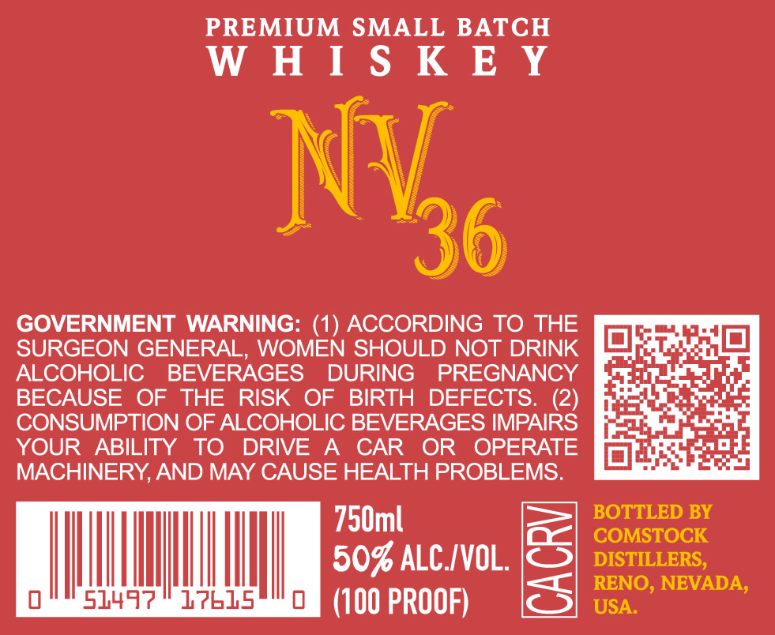
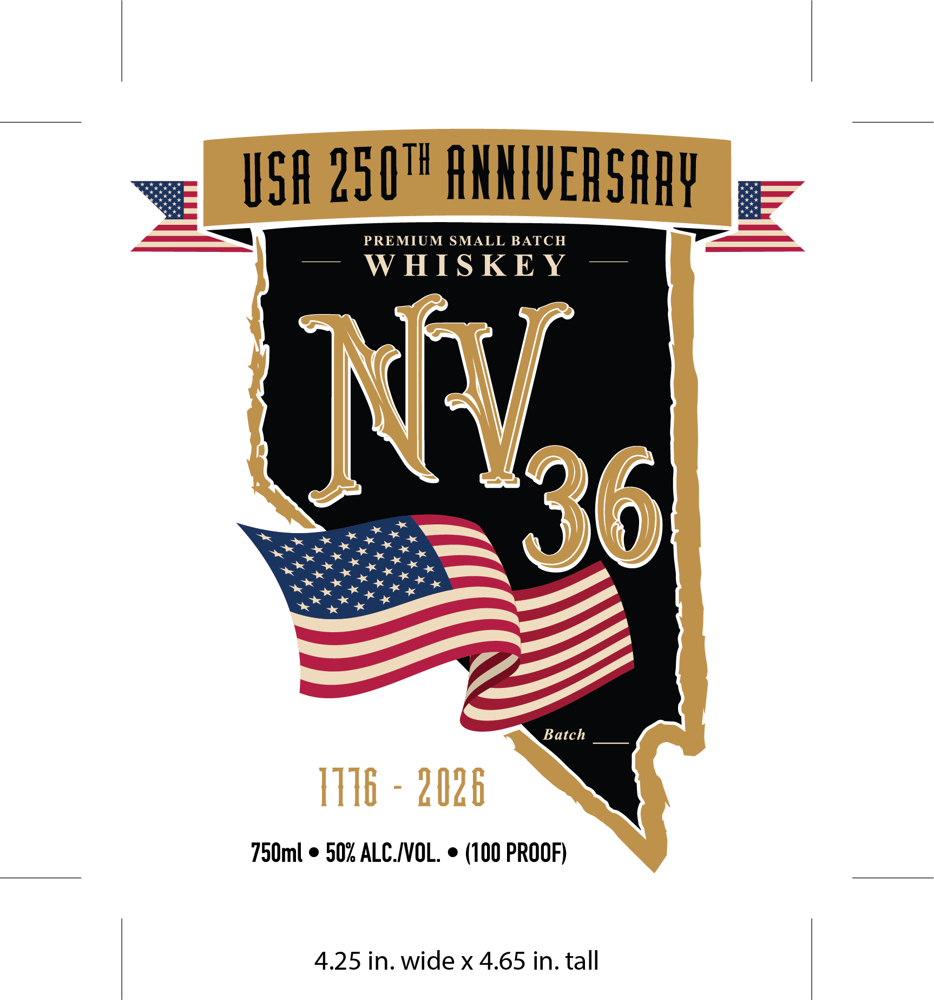

# TTB COLA Label Images - TTBID 26118001000303

**Brand Name:** WHISKEY NV 36

**Issue Date:** 05/04/2026

**Origin Code:** 32

**Product Class/Type:** 140

**Source:** [TTB Public COLA Registry](https://ttbonline.gov/colasonline/viewColaDetails.do?action=publicFormDisplay&ttbid=26118001000303)

## Label Images

### Back Label

### Front Label

## Extracted Label Text

*Text extracted via OCR - may contain errors*

**Detected Proof:** 100

### Back Label

PREMIUM SMALL BATCH
= N = =
( \
N =
"36
59)
GOVERNMENT WARNING: (1) ACCORDING TO THE imiiaea
SURGEON GENERAL, WOMEN SHOULD NOT DRINK 1 are
ALCOHOLIC BEVERAGES DURING PREGNANCY Ee in
BECAUSE OF THE RISK OF BIRTH DEFECTS. (2) [ReSataC. aria
CONSUMPTION OF ALCOHOLIC BEVERAGES IMPAIRS [Rest =
YOUR ABILITY TO DRIVE A CAR OR OPERATE Figg i
MACHINERY, AND MAY CAUSE HEALTH PROBLEMS. Sata hE
790ml Be| Comstock
50% ALC./VOL. SB).
tie eae eee tee (100 PROOF) <5] usa.’ ’

### Front Label

vee USA 250" ANNIVERSARY g—
——— PREMIUM SMALL BATCH Se ———
— WHISKEY —
~ eK ? = 36

peer inae se * be N
Rese ree rte =,
Batch
750ml ¢ 50% ALC./VOL. © (100 PROOF)
4.25 in. wide x 4.65 in. tall
