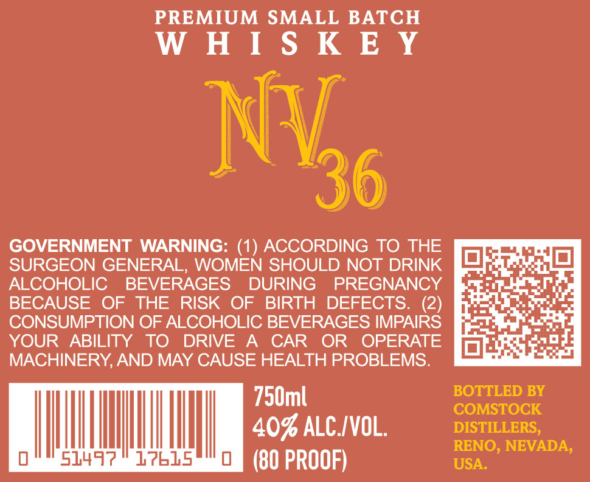
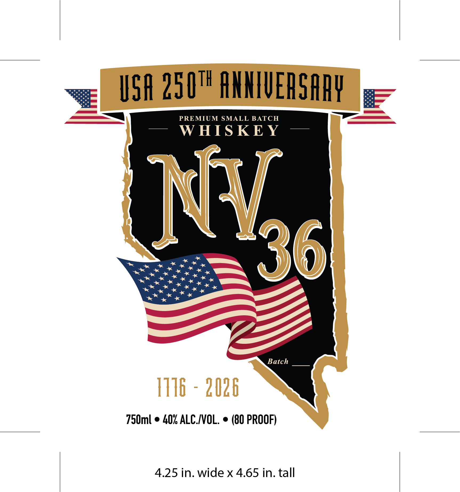

# TTB COLA Label Images - TTBID 26118001000310

**Brand Name:** WHISKEY NV 36

**Issue Date:** 05/04/2026

**Origin Code:** 32

**Product Class/Type:** 140

**Source:** [TTB Public COLA Registry](https://ttbonline.gov/colasonline/viewColaDetails.do?action=publicFormDisplay&ttbid=26118001000310)

## Label Images

### Back Label

### Front Label

## Extracted Label Text

*Text extracted via OCR - may contain errors*

**Detected Proof:** 80

### Back Label

PREMIUM SMALL BATCH

Ee

GOVERNMENT WARNING: (1) ACCORDING TO THE
SURGEON GENERAL, WOMEN SHOULD NOT DRINK
ALCOHOLIC BEVERAGES DURING PREGNANCY
BECAUSE OF THE RISK OF BIRTH DEFECTS. (2)
CONSUMPTION OF ALCOHOLIC BEVERAGES IMPAIRS
YOUR ABILITY TO DRIVE A CAR OR OPERATE
MACHINERY, AND MAY CAUSE HEALTH PROBLEMS.

750ml BOTTLED BY
| | AOSALCIVOL, §——vistutens,
RENO, NEVADA,

eda bee (80 PROOF) USA.

### Front Label

see USA 250" ANNIVERSARY. .—
——— PREMIUM SMALL BATCH Se ———
— WHISKEY —
~ eK ? = 36
peer inae se * be N
Rese ree rte =,
Batch
750ml © 40% ALC./VOL. ¢ (80 PROOF)
4.25 in. wide x 4.65 in. tall
