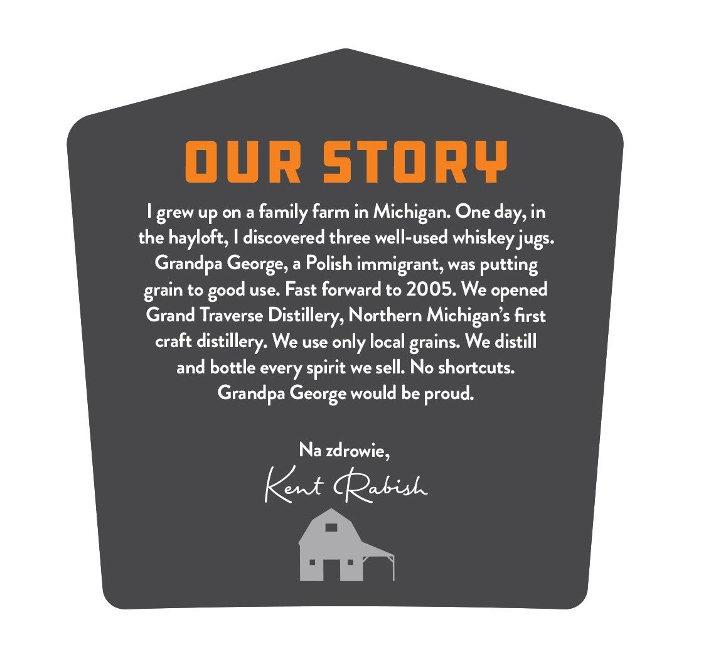
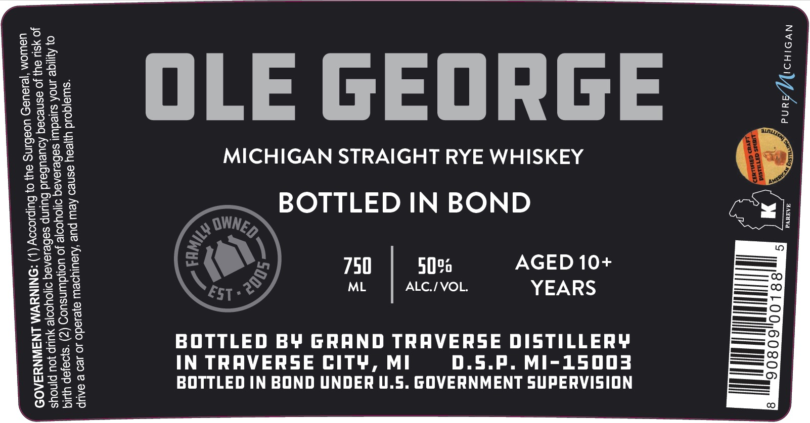

# TTB COLA Label Images - TTBID 26118001000312

**Brand Name:** GRAND TRAVERSE DISTILLERY

**Fanciful Name:** OLE GEORGE 10 YEAR BOTTLED IN BOND

**Issue Date:** 04/30/2026

**Origin Code:** 06

**Product Class/Type:** 119

**Source:** [TTB Public COLA Registry](https://ttbonline.gov/colasonline/viewColaDetails.do?action=publicFormDisplay&ttbid=26118001000312)

## Label Images

### Back Label

### Label 1

## Extracted Label Text

*Text extracted via OCR - may contain errors*

**Detected Proof:** 100

### Back Label

our story
grew up on a
family farm in
One day, in
the hayloft, I discovered three well-used whiskey jugs.
a
Polish immigrant, was putting
to
use: Fast forward to 2005. We
Grand Traverse Distillery, Northern Michigan s first
craft
We use only local
We distill
and bottle every spirit we sell: No shortcuts:
Grandpa George would be proud
Na zdrowie,
Kent Qabis
Michigan: '
Grandpa
George; '
opened
grain
good
distillery:
grains:

### Label 1

fe)

£2

Ox.

$o%

-S 0

Tis &

Fos

5S 2>0

oOe

Os

gs

OLE GEORGE

Soa

oo 2

aes

p>==

S200

Ono

NSO

MICHIGAN STRAIGHT RYE WHISKEY

SOO

26S o

ao

=

wil

Peo

© 2

DSSCE

==

BOTTLED IN BOND

Sees

Lose

o2

Roe

—S

oe

Sa

¢

AGED 10+

98

a=) fel

750

50%

= ©.

Z2oEa

ML

ALC./ VOL.

YEARS

————=

econ

ay = (=

—— T—

aags

oO

=

ee

wO

te)

2c

No

—= ©

Th

SHO

BOTTLED BY GRAND TRAVERSE DISTILLERY

er CO

—

Z2os

2eou

IN TRAVERSE CITY, MI

D.5.P. MI-15003

—_——©

wesge

wos

————)

Sec

BOTTLED IN BOND UNDER U.S. GOVERNMENT SUPERVISION

Oete

Onsc

=
