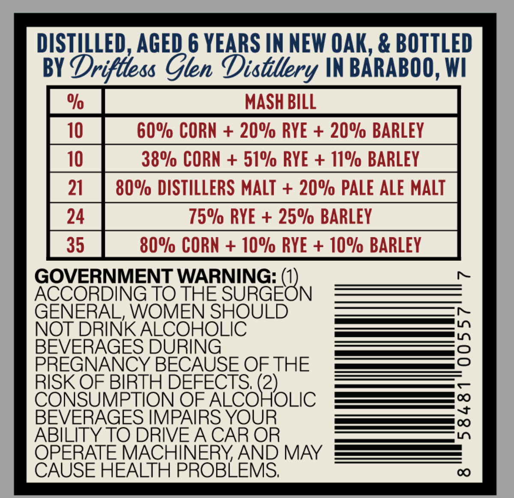
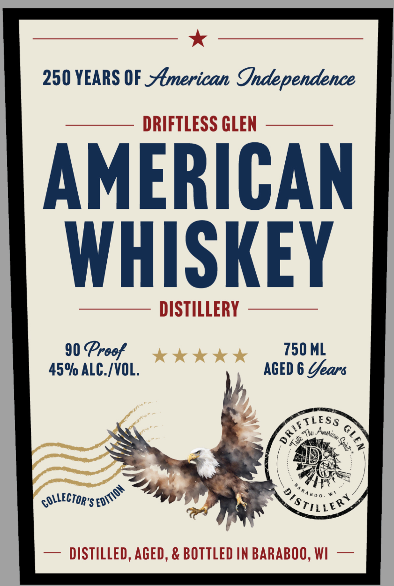

# TTB COLA Label Images - TTBID 26118001000500

**Brand Name:** DRIFTLESS GLEN

**Issue Date:** 04/30/2026

**Origin Code:** 48

**Product Class/Type:** 140

**Source:** [TTB Public COLA Registry](https://ttbonline.gov/colasonline/viewColaDetails.do?action=publicFormDisplay&ttbid=26118001000500)

## Label Images

### Back Label

### Front Label

## Extracted Label Text

*Text extracted via OCR - may contain errors*

**Detected Proof:** 90
**Detected Age:** 6 Years

### Back Label

DISTHLLED, AGED 6 YEARS IN NEW OAK, & BOTTLED
BY
Drifttess Glen Distllery IN BARABOO,WI
%
MASH BILL
10
60% CORN
20% RYE
20% BARLEY
10
38% CORN + 51% RYE + 17% BARLEY
21
80% DISTILLERS MALT
20% PALE ALE MALT
24
75% RYE + 25% BARLEY
35
80% CORN + 10% RYE + 10% BARLEY
GOVERNMENT WARNING:
ACCORDING TO THE SURGEON
GENERAL, WOMEN SHOULD
NOT DRINK ALCOHOLIC
3
BEVERAGES DURING
PREGNANCY BECAUSE OF THE
RISK OF BIRTH DEFECTS; (2)
CONSUMPTION OF ALCOHOLIC
BEVERAGES IMPAIRS YOUR
0
ABILITYTO DRIVEACAR OR
OPERATE MACHINERYAND MAY
CAUSE HEALTH PROBLEMS;
0

### Front Label

250 YEARS OF _merican
Independence
DRIFTLESS GLEN
AMERICAN
WHISKEY
DISTILLERY
90 Preof
750 ML
45% ALC /VOL;
AGED 6 Uears
TLESS
Alu
K
94
GOLLECTOR'S '
910
DISTILLED, AGED, & BOTTLED AN BARABOO, WI
1
1
Anthutnw
"EDITIon
8 0 0 =
