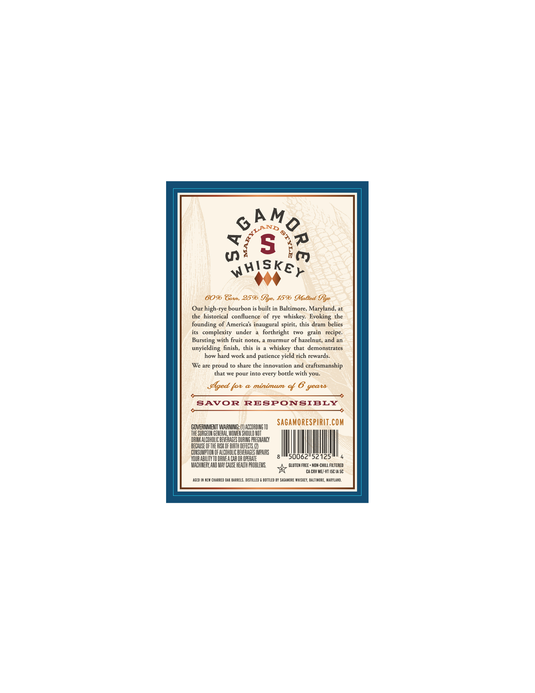
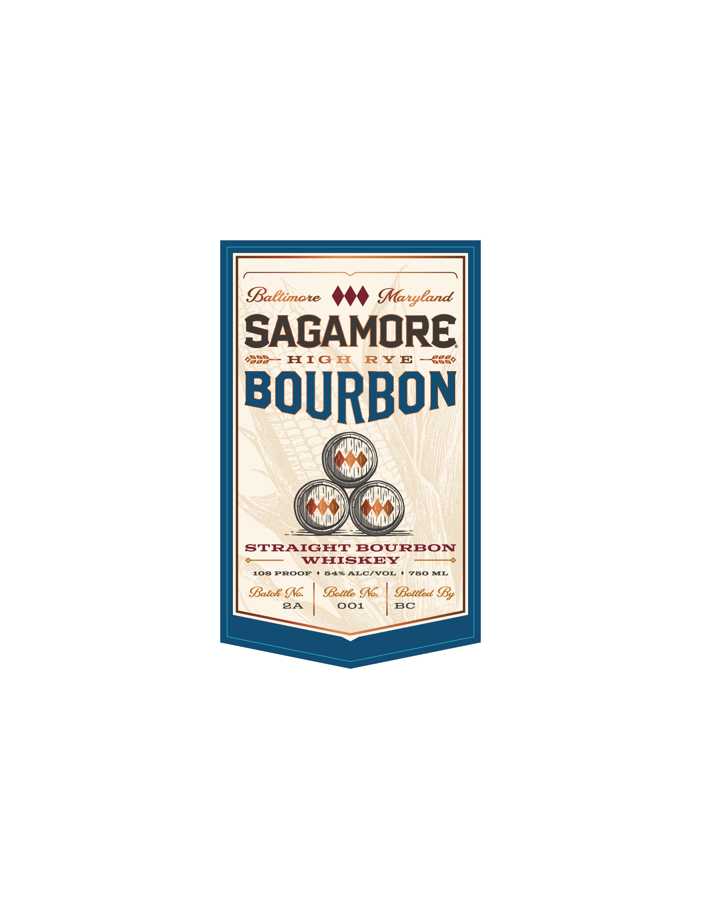

# TTB COLA Label Images - TTBID 26118001000594

**Brand Name:** SAGAMORE

**Fanciful Name:** HIGH RYE BOURBON

**Issue Date:** 05/07/2026

**Origin Code:** 25

**Product Class/Type:** 101

**Source:** [TTB Public COLA Registry](https://ttbonline.gov/colasonline/viewColaDetails.do?action=publicFormDisplay&ttbid=26118001000594)

## Label Images

### Back Label

### Front Label

## Extracted Label Text

*Text extracted via OCR - may contain errors*

**Detected Proof:** 108

### Back Label

5
(
whiskey
6096 Gorrs 2596
%ye, 1596 MMaBted Sye
Our high-rye bourbon is built in Baltimore, Maryland, at
the historical   confluence of rye whiskey:  Evoking the
founding of Americas inaugural spirit, this dram belies
its
complexity
under
forthright
[WO
recipe:
Bursting with fruit notes,
murmur
of hazelnut; and an
unyielding finish, this is
whiskey that  demonstrates
how hard work and patience yield rich rewards.
We are
to share the innovation and
craftsmanship
that we pour into every bottle with you
Sged fot
@ minimum
%
SAvOR
RESPONSIBLY
Sagamorespirit.com
GOVERMMENT WARNING:
ACCORDING TO
THE SURGEON GENERAL, WOMEN ShOuLD NOT
DRIK ALCOHOLIC BEVERAGES DURING PREGNANCY
BECAUSE OFTHE ISK OF BIRTH DEFECTS
CONSUMPTHON OF ALCOHOLIC BEVERAGES IMPAIRS
VOUR ABILITY TO DRIVE A CAR OR OPERATE
50062
52125
MACHIERK AND MAY CAUSE HEALTH PROBLEMS
GLUTEN FREE - NOM-CHILL FILTERED
CA CRV ME/-VT ISC IA 5C
AGED IN NEW CHARRED OAK BarReLS . distilleD
BOTTLed BY SAGAMORE WhISKEY, BALTIMORE , MaRyLAND:
PM@R0
9
ALANo
9
grain
proud
yeatd

### Front Label

BaCtimote
Maryland
SAGAMORE
HIG II
RY E
BOURBON
STRAIGHT
BOURBON
WHISKEY
108 PROOF
54%
ALCVOL
750 ML
Batce Io
SBottlee Io:
SBottled IBy
2A
001
BC
