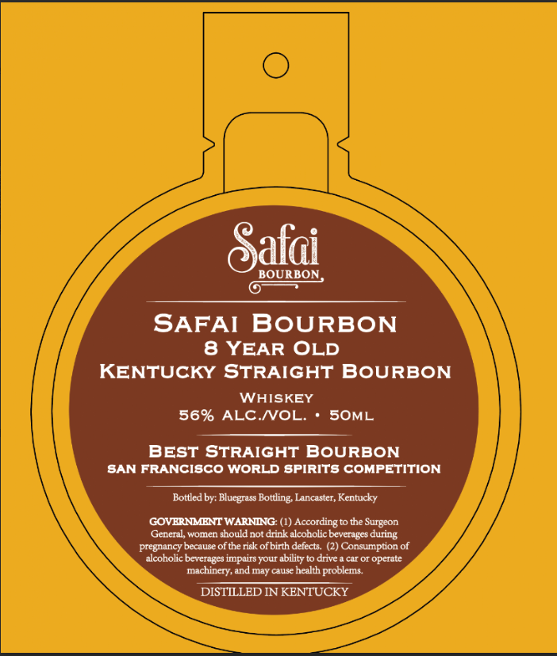

# TTB COLA Label Images - TTBID 26118001000637

**Brand Name:** SARAI BOURBON

**Issue Date:** 05/13/2026

**Origin Code:** 22

**Product Class/Type:** 101

**Source:** [TTB Public COLA Registry](https://ttbonline.gov/colasonline/viewColaDetails.do?action=publicFormDisplay&ttbid=26118001000637)

## Label Images

### Label 1

### Label 2

## Extracted Label Text

*Text extracted via OCR - may contain errors*

**Detected Proof:** 112
**Detected Age:** 8 Years

### Label 1

Gafai
BOURBON
SAFAI
BoURBON
8 YEAR OLD
KENTUCKY STRAIGHT BOURBON
WAISKEY
56% ALC NVOL:
SOML
BEST STRAIGHT BOURBON
SAN FRANCISCO WORLD SPIRITS COMPETITION
Bottled by: Bluegrass Bottling Lancaster, Kentucky
GOVERNMENT WARNING: (1) Accordingto the Surgeon
General, women should not drink alcoholic beverages during
pregnancy because of the risk ofbirth defects
(2) Consumption of
alcoholic beverages impairs your ability to drive & car Or operate
machinery, and may cause health problems
DISTILLED IN KENTUCKY

### Label 2

BEST OF CLASS
1
WINNER
TAI '
ALLIANCE
TASTING
THE
THE
1
1
1
1
1
1
JONVITIV _
JONVITTV_
DNILSVI _
