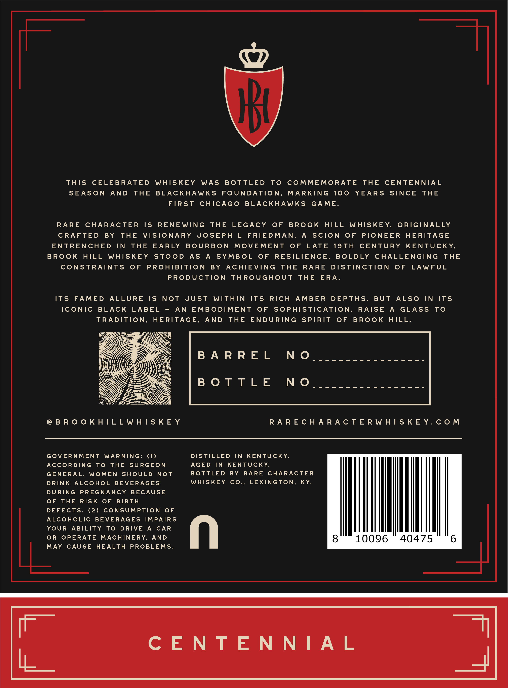
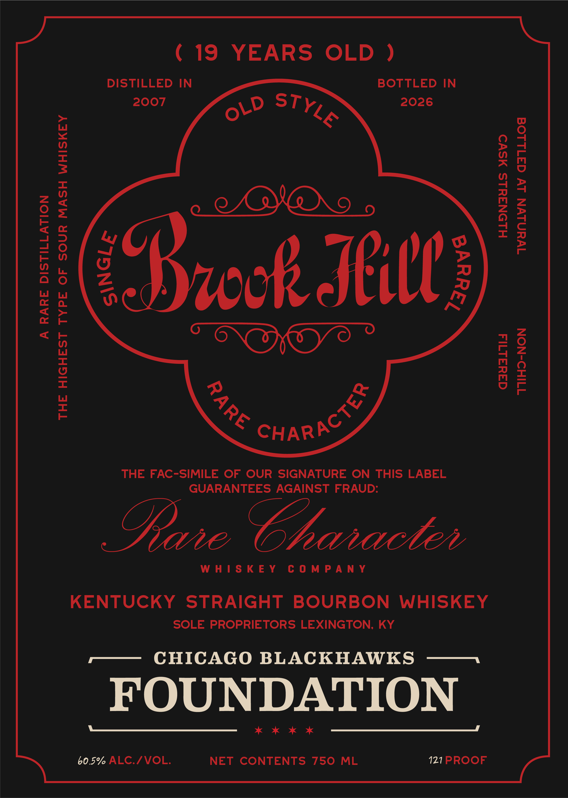

# TTB COLA Label Images - TTBID 26118001000655

**Brand Name:** BROOKHILL

**Fanciful Name:** OLD STYLE

**Issue Date:** 04/30/2026

**Origin Code:** 22

**Product Class/Type:** 101

**Source:** [TTB Public COLA Registry](https://ttbonline.gov/colasonline/viewColaDetails.do?action=publicFormDisplay&ttbid=26118001000655)

## Label Images

### Back Label

### Front Label

## Extracted Label Text

*Text extracted via OCR - may contain errors*

**Detected Proof:** 121
**Detected Age:** 19 Years

### Back Label

THIS CELEBRATED WHISKEY WAS BOTTLED TO COMMEMORATE THE CENTENNIAL
SEASON AND THE BLACKHAWKS FOUNDATION, MARKING 100 YEARS SINCE THE
FIRST CHICAGO BLACKHAWKS GAME.

RARE CHARACTER IS RENEWING THE LEGACY OF BROOK HILL WHISKEY. ORIGINALLY
CRAFTED BY THE VISIONARY JOSEPH L FRIEDMAN, A SCION OF PIONEER HERITAGE
ENTRENCHED IN THE EARLY BOURBON MOVEMENT OF LATE 19TH CENTURY KENTUCKY,
BROOK HILL WHISKEY STOOD AS A SYMBOL OF RESILIENCE, BOLDLY CHALLENGING THE
CONSTRAINTS OF PROHIBITION BY ACHIEVING THE RARE DISTINCTION OF LAWFUL
PRODUCTION THROUGHOUT THE ERA.

ITS FAMED ALLURE IS NOT JUST WITHIN ITS RICH AMBER DEPTHS. BUT ALSO IN ITS

ICONIC BLACK LABEL - AN EMBODIMENT OF SOPHISTICATION. RAISE A GLASS TO
TRADITION, HERITAGE, AND THE ENDURING SPIRIT OF BROOK HILL.

BARREL NO

BOTTLE NO

@eBROOKHILLWHISKEY RARECHARACTERWHISKEY.COM

GOVERNMENT WARNING: (1) DISTILLED IN KENTUCKY.

ACCORDING TO THE SURGEON AGED IN KENTUCKY.
GENERAL, WOMEN SHOULD NOT BOTTLED BY RARE CHARACTER
DRINK ALCOHOL BEVERAGES WHISKEY CO., LEXINGTON, KY.

DURING PREGNANCY BECAUSE
OF THE RISK OF BIRTH
DEFECTS. (2) CONSUMPTION OF
ALCOHOLIC BEVERAGES IMPAIRS
YOUR ABILITY TO DRIVE A CAR
OR OPERATE MACHINERY, AND
MAY CAUSE HEALTH PROBLEMS.

40475 6

### Front Label

(19 YEARS OLD )

DISTILLED IN

BOTTLED IN

2007

2026

oW TYG

()

Re

Fe CHAR

ING

THE FAC-SIMILE OF OUR SIGNATURE ON THIS LABEL

GUARANTEES AGAINST FRAUD:

Dine Character

WHISKEY COMPANY

KENTUCKY STRAIGHT BOURBON WHISKEY

SOLE PROPRIETORS LEXINGTON, KY

-— CHICAGO BLACKHAWKS ——

FOUNDATION

* KK

60.5% ALC./VOL.

NET CONTENTS 750 ML

121 PROOF
