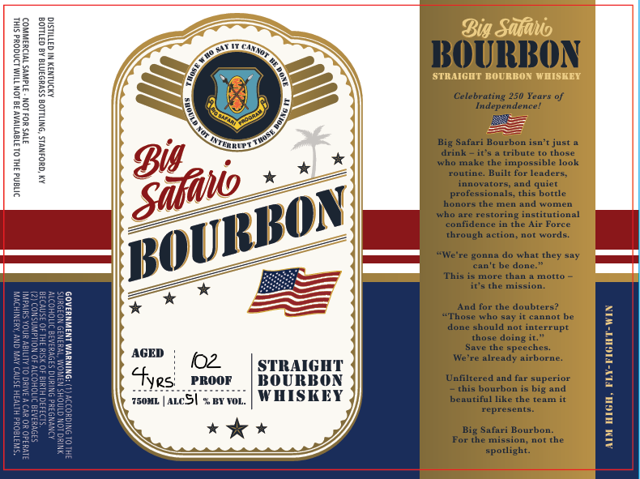

# TTB COLA Label Images - TTBID 26118001000705

**Brand Name:** BIG SAFARI

**Issue Date:** 05/06/2026

**Origin Code:** 22

**Product Class/Type:** 101

**Source:** [TTB Public COLA Registry](https://ttbonline.gov/colasonline/viewColaDetails.do?action=publicFormDisplay&ttbid=26118001000705)

## Label Images

### Front Label

## Extracted Label Text

*Text extracted via OCR - may contain errors*

### Front Label

0
0
Big Safahio
Hh
BBOURIBON
STRAIGUT BOURIBON WIISKEY
Celebrating 250
Independence_
L
LL
Big Safari Bourbon isn'
just
1
drin
it 9
Tribute
Thoze
ho
make the impossible look
routine
Built for-
leaders
innovators;
anide
professionals_
this bottle
onors
mem
andl
women
Aho
restoring
inetitutonal
comnndence
through
action_not
words
"We
gonna
Lhar
can
done
This
OTE
cham
m
it'9 the mission.
Wad
L
"Thosd fohaheyoubatenot
:
8
0
done
should not
interrupt
8
E
Stbesadojeeches.
1
1
8
I
AGED
002
STRAIGHT
We're
alreadu
airborne
7
3
E
$yes
PROOF
BOURBON
Unfiltered and far superior
2
this bourbon is big and
750ML
Acsi : FFO:
W HISKEY
beautiful like the
Teatnn
F
represents
1
Vat
BinGafasi Bourbo the
1
1
4
spotlight:
Years
Big
Safao
4uler
BOURBON
Feorce
they
