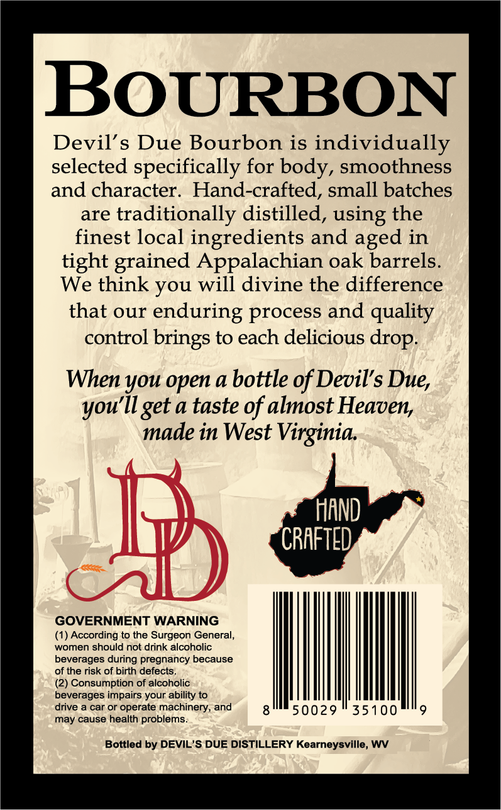
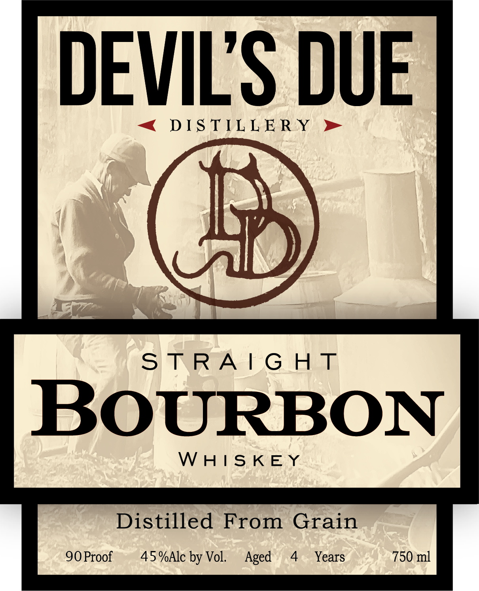
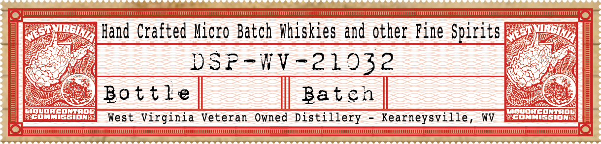

# TTB COLA Label Images - TTBID 26118001000758

**Brand Name:** DEVIL'S DUE DISTILLERY

**Fanciful Name:** SIGNATURE BOURBON

**Issue Date:** 05/05/2026

**Origin Code:** 47

**Product Class/Type:** 101

**Source:** [TTB Public COLA Registry](https://ttbonline.gov/colasonline/viewColaDetails.do?action=publicFormDisplay&ttbid=26118001000758)

## Label Images

### Back Label

### Front Label

### Label 2

### Label 3

## Extracted Label Text

*Text extracted via OCR - may contain errors*

*1 image(s) excluded: text did not meet readability threshold*

**Detected Proof:** 90
**Detected Age:** 4 Years

### Back Label

BOURBON
Devil' s Due Bourbon is
individually
selected specifically for body, smoothness
and character:
Hand-crafted, small batches
are
traditionally distilled, using the
finest local ingredients and
in
tight grained Appalachian oak barrels.
We think you will divine the difference
that our
enduring process and quality
control
to each delicious
When you open a bottle of Devil's
ilget a taste of almost Heaven
made in West Virginia
HAND
CRAFTED
GOVERNMENT WARNING
(1) According to the Surgeon General,
women should not drink alcoholic
beverages during pregnancy because
of the risk of birth defects_
(2) Consumption of alcoholic
beverages impairs your ability to
drive a car or operate machinery, and
50029
35100
may cause health problems_
Bottled by DEVIL 'S DUE DISTILLERY Kearneysville, WV
aged
brings -
drop:
Due,
you [

### Front Label

DEVILS DUE

DISTILLERY

3) TW |G oe

BOURBON

WHISKEY

Distilled From Grain

90 Proof

45 %Alc by Vol.

Aged 4 Years

750 ml

### Label 3

Hand Crafted Micro Batch Whiskies and other Fine Spirits

DSP-WV-21932

Bottle

Baten

West Virginia Veteran Owned Distillery - Kearneysville, WV
