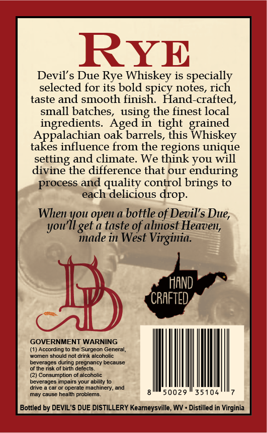
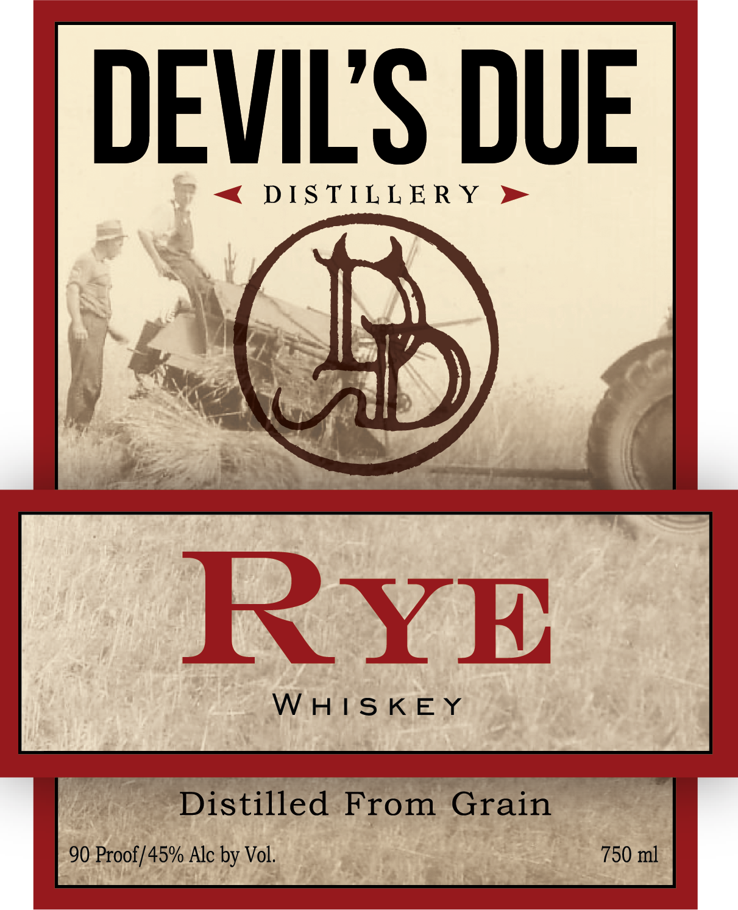
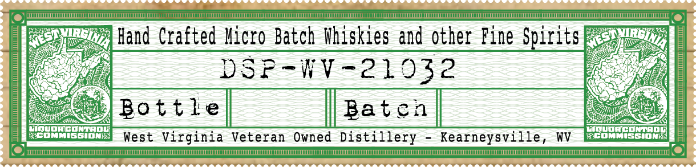

# TTB COLA Label Images - TTBID 26118001000791

**Brand Name:** DEVIL'S DUE DISTILLERY

**Fanciful Name:** SIGNATURE RYE

**Issue Date:** 05/07/2026

**Origin Code:** 47

**Product Class/Type:** 142

**Source:** [TTB Public COLA Registry](https://ttbonline.gov/colasonline/viewColaDetails.do?action=publicFormDisplay&ttbid=26118001000791)

## Label Images

### Back Label

### Front Label

### Label 2

### Label 3

## Extracted Label Text

*Text extracted via OCR - may contain errors*

*1 image(s) excluded: text did not meet readability threshold*

**Detected Proof:** 90

### Back Label

RYE
Devil' s Due Rye
Whiskey is specially
selected
its bold spicy notes, rich
taste and smooth finish
Hand-crafted,
small batches,
the finest local
ingredients.
Aged in tight
grained
Appalachian oak barrels, this Whiskey
takes influence from the regions unique
and climate. We think you will
divine the difference that our enduring
process and quality control brings to
each delicious
When you open a bottle of Devil's
youll get & taste of aliost Heaven;
mnade in West
Virginia.
HAND
CRAFTED
GOVERNMENT WARNING
(1) According to the Surgeon General,
women should not drink alcoholic
beverages during pregnancy because
of the risk of birth defects.
(2) Consumption of alcoholic
beverages impairs your ability to
dnve
operate machinery; and
may cause health problems.
50029
35104
Bottled by DEVIL 'S DUE DISTILLERY Kearneysville, WV . Distilled in Virginia
for
using
setting
drop.
Due,

### Front Label

DEVILS DUE

DISTILLERY

WHISKEY

Distilled From Grain
90 Proof/45% Alc by Vol. 750 ml

### Label 3

a) ENT ae ETE

SE EEEETETCE

TTT

cy

ES

iy

Hand Crafted Micro Batch Whiskies and other Fine Spirits

DSP-WV-21032

Bovete] — aarcal

ug

o

A

IMMISSIONS

West Virginia Veteran Owned Distillery - Kearneysville, wv

anes Soe

—

see

co)

MMT SCION =|

Of

TTT] (@)
