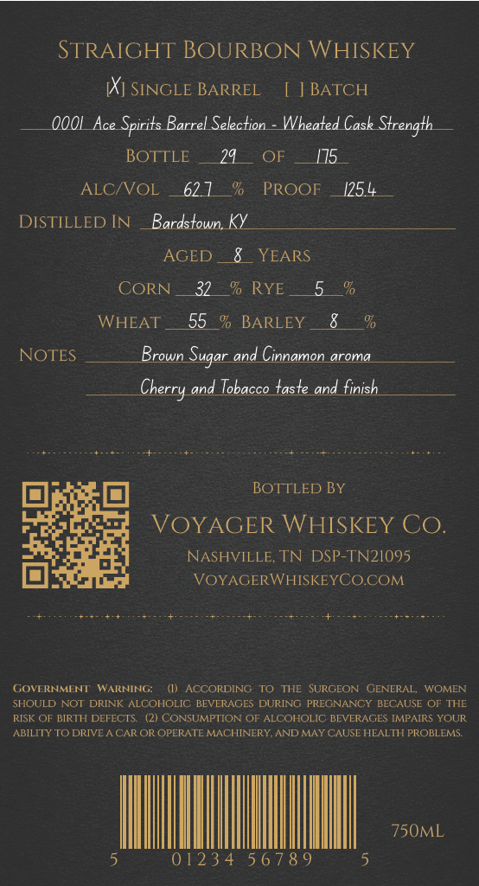
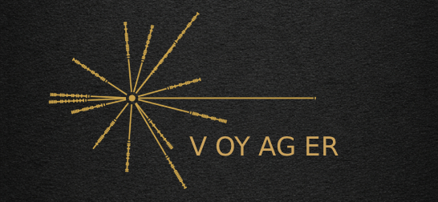

# TTB COLA Label Images - TTBID 26118001000909

**Brand Name:** VOYAGER WHISKEY CO

**Issue Date:** 05/12/2026

**Origin Code:** 43

**Product Class/Type:** 101

**Source:** [TTB Public COLA Registry](https://ttbonline.gov/colasonline/viewColaDetails.do?action=publicFormDisplay&ttbid=26118001000909)

## Label Images

### Back Label

### Front Label

## Extracted Label Text

*Text extracted via OCR - may contain errors*

*1 image(s) excluded: text did not meet readability threshold*

**Detected Proof:** 125

### Back Label

STRAIGHT BOURBON WHISKEY
Kj SINGLE BARREL
[] BATCH
OOOL_Ace Spirits Barrel Selection
Wheated Cask Strength
BOTTLE
29
OF
175
ALCNOL
62 1
%o
PROOF
1254
DISTILLED IN
Bardstown
AGED
YEARS
CORN
32
%o RYE
5
WHEAT
55
BARLEY
NOTES
Brown
and Cinnamon aroma
and Tobacco taste and finish
BOTTLED BY
VOYAGER WHISKEY CO.
NASHVILLE, TN DSP-TN2I095
VOYAGERWHISKEYCOCOM
GOvERNMENT
WARNING:
ACCORDING
THE
SURGEON
GENERAL,
WOMEN
SHOULD NOT DRINK ALCOHOLIC BEVERAGES DURING PREGNANCY BECAUSE OF THE
RISK OF BIRTH DEFECTS
21 CONSUMPTION OF ALCOHOLIC BEVERAGES IMPAIRS YOUR
ABILITY TO DRIVE
CAR OR OPERATE MACHINERY,AND MAYCAUSE HEALTH PROBLEMS.
750ML
0123 4 5 6 7 8 9
Sugar
Cherry
