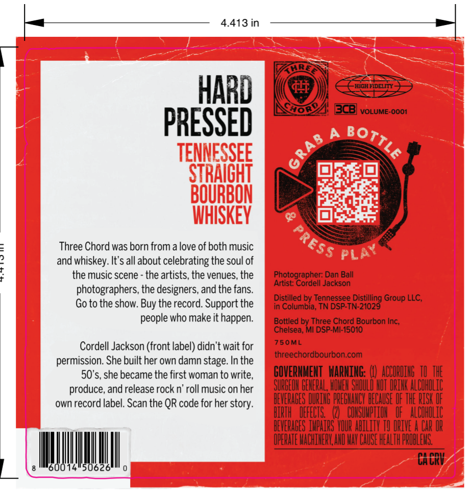
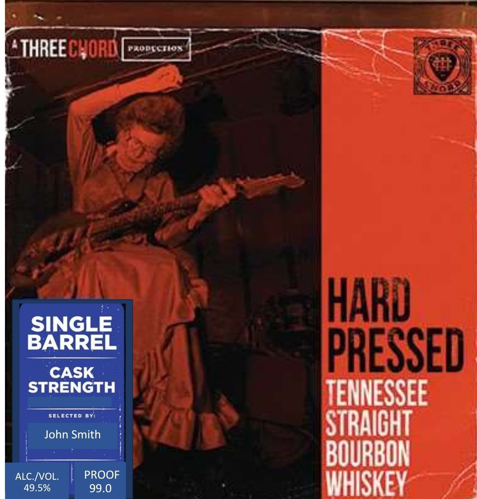

# TTB COLA Label Images - TTBID 26118001000912

**Brand Name:** THREE CHORD

**Issue Date:** 05/06/2026

**Origin Code:** 06

**Product Class/Type:** 101

**Source:** [TTB Public COLA Registry](https://ttbonline.gov/colasonline/viewColaDetails.do?action=publicFormDisplay&ttbid=26118001000912)

## Label Images

### Back Label

### Front Label

## Extracted Label Text

*Text extracted via OCR - may contain errors*

**Detected Proof:** 99

### Back Label

4.413 in
HArD
fli
HIGHFIDELITY =
3ob2
BcB]
VOLUME-OOO1
PRESSED
A
TENNESSEE
STRAICHT
BOURBON
WHISKEY
Three Chord was born from a love of both music
and whiskey. It's all about celebrating the soul of
the music scene - the artists, the venues, the
Photographer: Dan Ball
Artist: Cordell Jackson
photographers; the designers, and the fans.
Distilled by Tennessee Distilling Group LLC,
Go to the show:
the record. Support the
in Columbia; TN DSP-TN-21029
people who make it happen.
Bottled by Three Chord Bourbon Inc;
Chelsea; MI DSP-MI-15010
Cordell Jackson (front label) didn't wait for
750ML
threechordbourboncom
permission: She built her own damn stage. In the
50*s, she became the first woman to write,
GOVERNMENT   WARNiNG:; ( ACCORDIHG  TU THE
produce, and release rock n' roll music on her
SURGEOH BEHERAL, MOHEH SHOULD HUT DRIHK ALCOHDLIC
own record label. Scan the QR code for her story:
BEVERAGES DURING PREGHANCY BECAUSE UF THE RISK UF
HIRTH   DEFECTS
COHSUMPIIOH   QF _ AlCOH_LIC
HEVERABES IMPAIRS VOUR ABILITV TU DRIVE A CaR OR
IPERATE MACHIHERY,AND MAY CAUSE HEALTH PROBLEMS
CA CRV
5062
BotTLE"
{
Press
PLaY
Buy

### Front Label

THREE CHORD
Tioao
HARD
SINGLE
BARREL
PRESSED
CASK
STRENGTH
TENNESSEE
selected BY:
John Smith
STRAICHT
BOURBON
ALC IVOL.
PROOF
49.5%
99.0
WHISKEY
