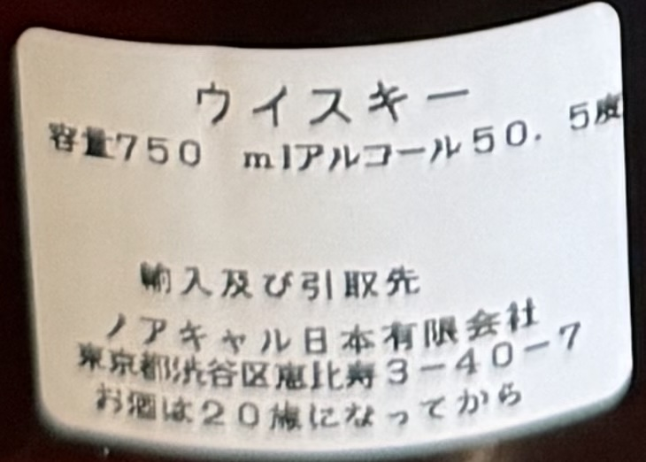
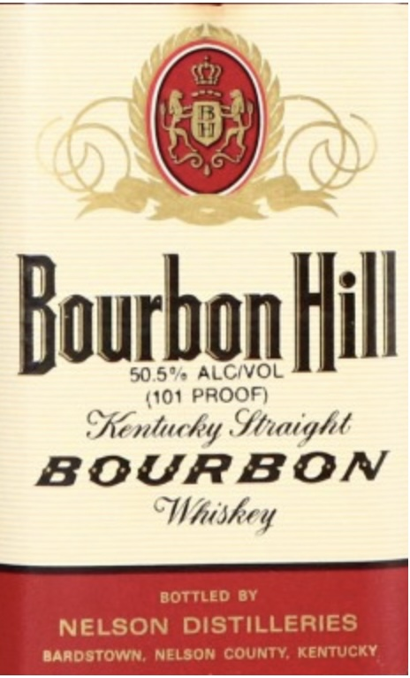
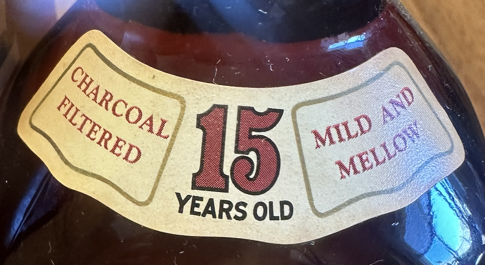
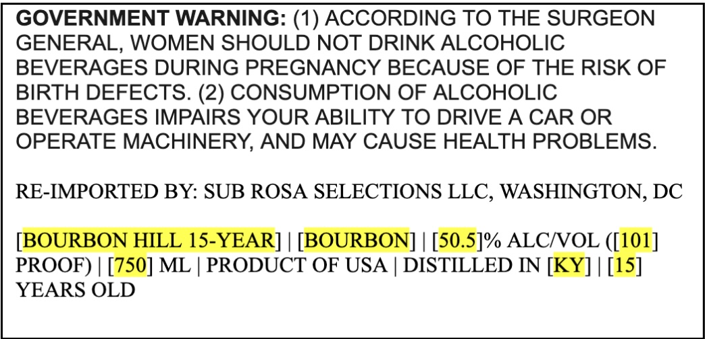

# TTB COLA Label Images - TTBID 26118001000939

**Brand Name:** BOURBON HILL 15-YEAR, HEAVEN HILL

**Issue Date:** 05/01/2026

**Origin Code:** 00

**Product Class/Type:** 101

**Source:** [TTB Public COLA Registry](https://ttbonline.gov/colasonline/viewColaDetails.do?action=publicFormDisplay&ttbid=26118001000939)

## Label Images

### Back Label

### Front Label

### Label 3

### Label 4

## Extracted Label Text

*Text extracted via OCR - may contain errors*

*1 image(s) excluded: text did not meet readability threshold*

**Detected Proof:** 101

### Front Label

RourbonHil
50 5%
ALCivOL
(101 PROOF)
SRentucky Stwight
BOURBON
BOTTLED BY
NELSON DISTiLLeRIES
Bardstown; Nelson County; KENTUCKY
cWhiskey

### Label 3

15
OLD
CHARCOAL
AND
FILTERED
MILD
MELLOW
YEARS

### Label 4

GOVERNMENT WARNING: (1) ACCORDING TO THE SURGEON
GENERAL, WOMEN SHOULD NOT DRINK ALCOHOLIC
BEVERAGES DURING PREGNANCY BECAUSE OF THE RISK OF
BIRTH DEFECTS. (2) CONSUMPTION OF ALCOHOLIC
BEVERAGES IMPAIRS YOUR ABILITY TO DRIVE A CAR OR
OPERATE MACHINERY, AND MAY CAUSE HEALTH PROBLEMS:
RE-IMPORTED BY: SUB ROSA SELECTIONS LLC, WASHINGTON, DC
[BOURBON HILL 15-YEAR]
BOURBON]
50.5]% ALCIOL ([101_
PROOF)
750] ML
PRODUCT OF USA
DISTILLED IN [KY]
15]
YEARS OLD
