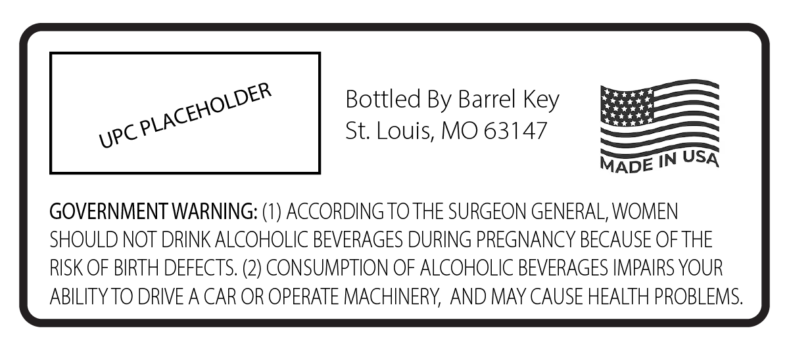
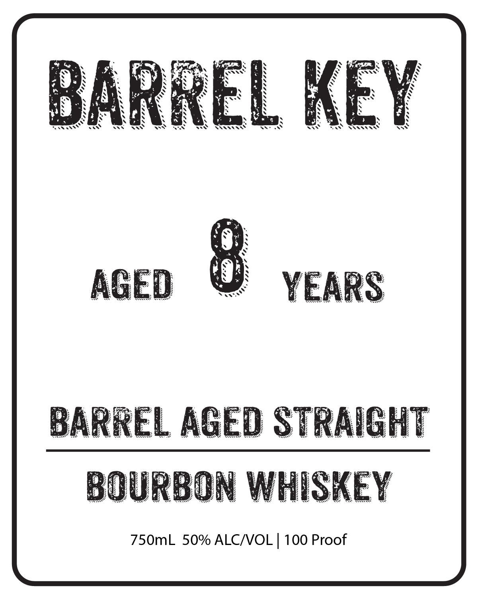

# TTB COLA Label Images - TTBID 26118001000972

**Brand Name:** BARREL KEY

**Issue Date:** 04/30/2026

**Origin Code:** 29

**Product Class/Type:** 101

**Source:** [TTB Public COLA Registry](https://ttbonline.gov/colasonline/viewColaDetails.do?action=publicFormDisplay&ttbid=26118001000972)

## Label Images

### Back Label

### Front Label

## Extracted Label Text

*Text extracted via OCR - may contain errors*

**Detected Proof:** 100

### Back Label

Bottled By Barrel
St. Louis, MO 63147
MADE TN USA
GOVERNMENT WARNING: (1) ACCORDING TO THE SURGEON GENERAL, WOMEN
SHOULD NOT DRINK ALCOHOLIC BEVERAGES DURING PREGNANCY BECAUSE OFTHE
RISK OF BIRTH DEFECTS. (2) CONSUMPTION OF ALCOHOLIC BEVERAGES IMPAIRS YOUR
ABILITYTO DRIVE A CAR OR OPERATE MACHINERY, AND MAY CAUSE HEALTH PROBLEMS.
PLACEHOLDER
Key
UPC

### Front Label

baRREL Key
AGED
YEARS
BARREL AGED STRAIGHT
BOURBON WHISKEY
750mL 50% ALCMOL | 100 Proof
