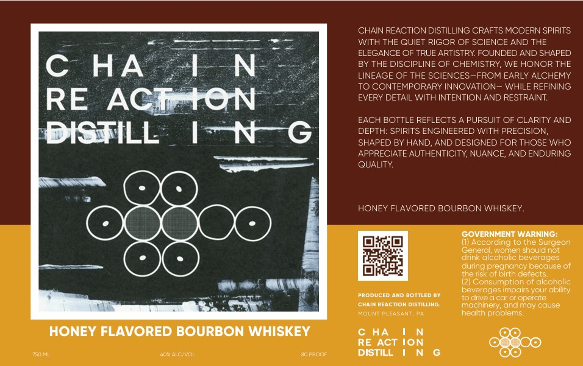

# TTB COLA Label Images - TTBID 26119001000006

**Brand Name:** CHAIN REACTION DISTILLING

**Issue Date:** 05/05/2026

**Origin Code:** 39

**Product Class/Type:** 149

**Source:** [TTB Public COLA Registry](https://ttbonline.gov/colasonline/viewColaDetails.do?action=publicFormDisplay&ttbid=26119001000006)

## Label Images

### Label 1

## Extracted Label Text

*Text extracted via OCR - may contain errors*

### Label 1

CHAIN REACTION DISTILLING CRAFTS MODERN SPIRITS
WITH THE QUIET RIGOR OF SCIENCE AND THE
ELEGANCE OF TRUE ARTISTRY FOUNDED AND SHAPED
C
HA
LN
BY THE DISCIPLINE OF CHEMISTRY, WE HONOR THE
LINEAGE OF THE SCIENCES-FROM EARLY ALCHEMY
TO CONTEMPORARY INNOVATION- WHILE REFINING
RE
ACIATON
EVERY DETAIL WITH INTENTIONAND RESTRAINT:
EACH BOTTLE REFLECTS
PURSUIT OF CLARITY AND
DISTILL
IN
DEPTH: SPIRITS ENGINEERED WITH PRECISION,
SHAPED BY HAND
AND DESIGNED FOR THOSE WHO
APPRECIATE AUTHENTICITY, NUANCE; AND ENDURING
QUALITY
HONEY FLAVORED BOURBON WHISKEY.
GOVERNMENT WARNING:
(u) According to the Surgeon
Genercl; women should not
drink alcoholc beverdges
during
(pregndnce
becuuseof
Ie Wsk
delects:
Consumption of clcoholic
beverdges impdirs your ability
PRODUCED AND DOTTLED @Y
todive
ceraroperate
ChAIM REACTIOM DISTILLING
machinery; andmay cause
MOUNI PLEASANI;
hecith problems
HONEY FLAVORED BOURBON WHISKEY
c HA
RE ACT ION
40KALC VOL
0proo
DISTILL
UZhu
