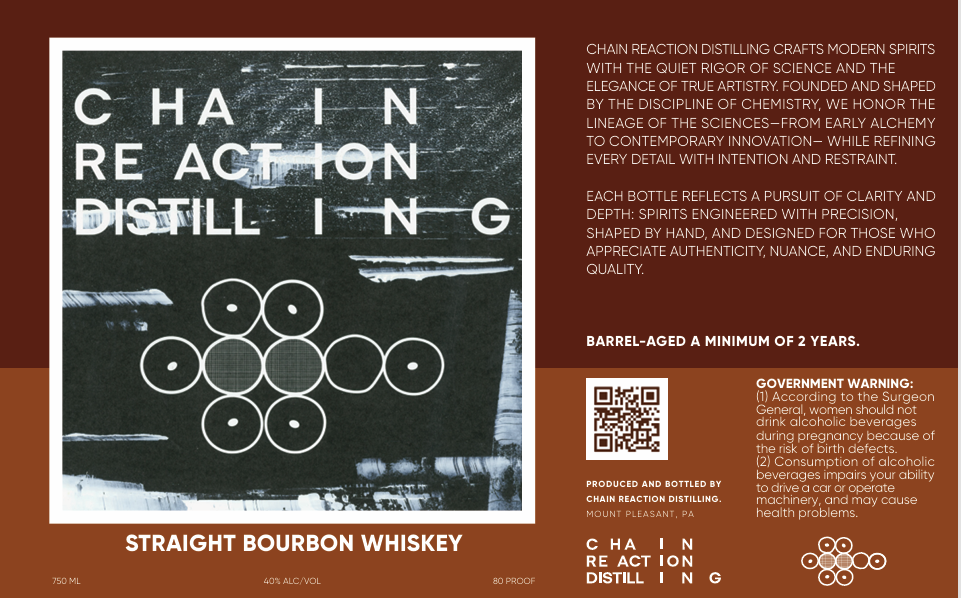

# TTB COLA Label Images - TTBID 26119001000007

**Brand Name:** CHAIN REACTION DISTILLING

**Issue Date:** 04/30/2026

**Origin Code:** 39

**Product Class/Type:** 101

**Source:** [TTB Public COLA Registry](https://ttbonline.gov/colasonline/viewColaDetails.do?action=publicFormDisplay&ttbid=26119001000007)

## Label Images

### Label 1

## Extracted Label Text

*Text extracted via OCR - may contain errors*

### Label 1

CHAIN REACTION DISTILLING CRAFTS MODERN SPIRITS
WITH THE QUIET RIGOR OF SCIENCE AND THE
ELEGANCE OF TRUE ARTISTRY FOUNDED AND SHAPED
C
HA
1N
BY THE DISCIPLINE OF CHEMISTRY WE HONOR THE
LINEAGE OF THE SCIENCES-FROM EARLY ALCHEMY
TO CONTEMPORARY INNOVATION- WHILE REFINING
RE
ACIAtON
EVERY DETAIL WITH INTENTION AND RESTRAINT
EACH BOTTLE REFLECTS
PURSUIT OF CLARITY AND
DISTILL
I~N
DEPTH: SPIRITS ENGINEERED WITH PRECISION,
SHAPED BY HAND
AND DESIGNED FOR THOSE WHO
APPRECIATE AUTHENTICITY, NUANCE;
AND ENDURING
QUALITY
BARREL-AGED
MINIMUM OF 2 YEARS_
GOVERNMENT WARNING:
(1) According to the Surgeon
General; wcmen should not
drink alcoholic beverages
during pregnancy because of
the risk ot birth detects
Consumption of alcoholic
beverages impairs your abilty
PRODUCED AND DOTTLED @Y
To clive
car Or operate
ChAIN REACTION DISTILLING
machinery, andmay couse
MOUNT PLEASANT
health problems:
STRAIGHT BOURBON WHISKEY
c HA
RE ACT ION
7S0
40"ALCNvOL
d0 ProOr
DISTILL
