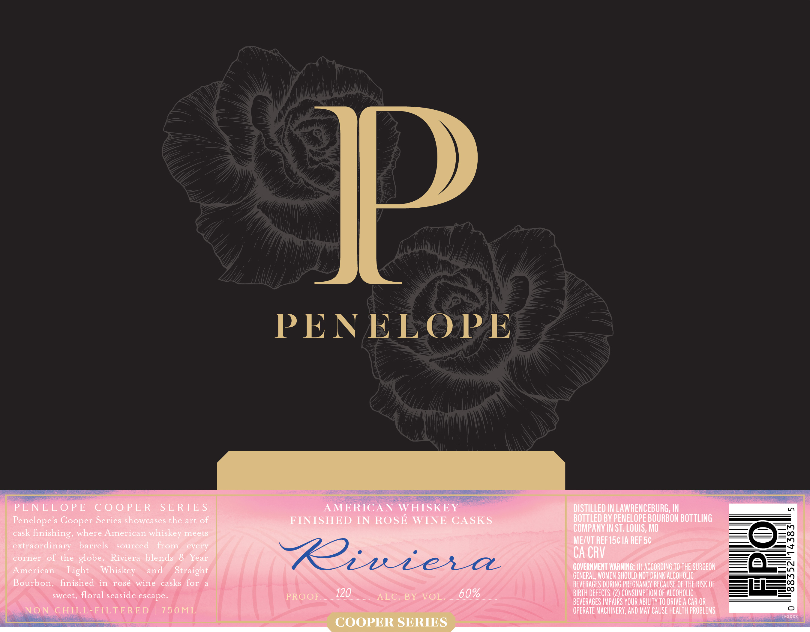
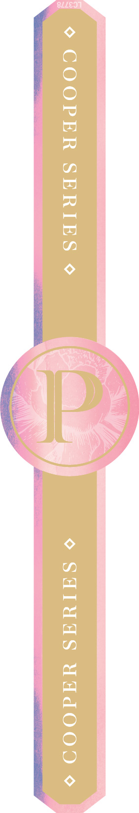

# TTB COLA Label Images - TTBID 26119001000045

**Brand Name:** PENELOPE

**Issue Date:** 04/30/2026

**Origin Code:** 29

**Product Class/Type:** 140

**Source:** [TTB Public COLA Registry](https://ttbonline.gov/colasonline/viewColaDetails.do?action=publicFormDisplay&ttbid=26119001000045)

## Label Images

### Front Label

### Label 2

## Extracted Label Text

*Text extracted via OCR - may contain errors*

*1 image(s) excluded: text did not meet readability threshold*

**Detected Proof:** 120
**Detected Age:** 8 Years

### Front Label

PENELOPE
PENELOPE
CooPE R
S E RIE $
AMERICAN WHISKEY
DISTILLED IN LAWRENCEBURG , IN
M
Penelope'
Series showcases the art
FINISHED IN ROSE WINE CASKS
BOTTLed BY PENELOPE BOURBON BOTTLING
cask
finishing, where American whiskey meets
COMPANV IN ST; LOUIS, Mo
MEZVT REF 15c IA REF 5c
extraordinary
barrels
sourced
from
every
corner
of the globe_
Riviera
blends 8
Year
Riuiela
CA CRV
American
Light
Whiskey
and
Straight
GOVERNMENT WARNING; (U) ACCORDING TO ThE SURGEON
GENERAL, WOMEN SHOULD NOT DRINK ALCOHOLIC
Bourbon,
finished
in
rose
wine
casks for
BEVERAGES DURING PREGNANCV BECAUSE OF THE RISK OF
sweet, floral seaside escape_
PROOF
120
ALC BY
VOL:
60%
BIRTH DEfEcts. (2) CONSUMPTION OF AlcoholIc
BEVERAGES IMPAIRS VOUR ABILITV TO DRIVE A CAR OR
NON
CHILL-FILTERE D
7 5 0ML
OPERATE MACHINERY, AND May CauSe HEALTH PROBLEMS.
LFXXXX
COOPER SERIES
Cooper
of
