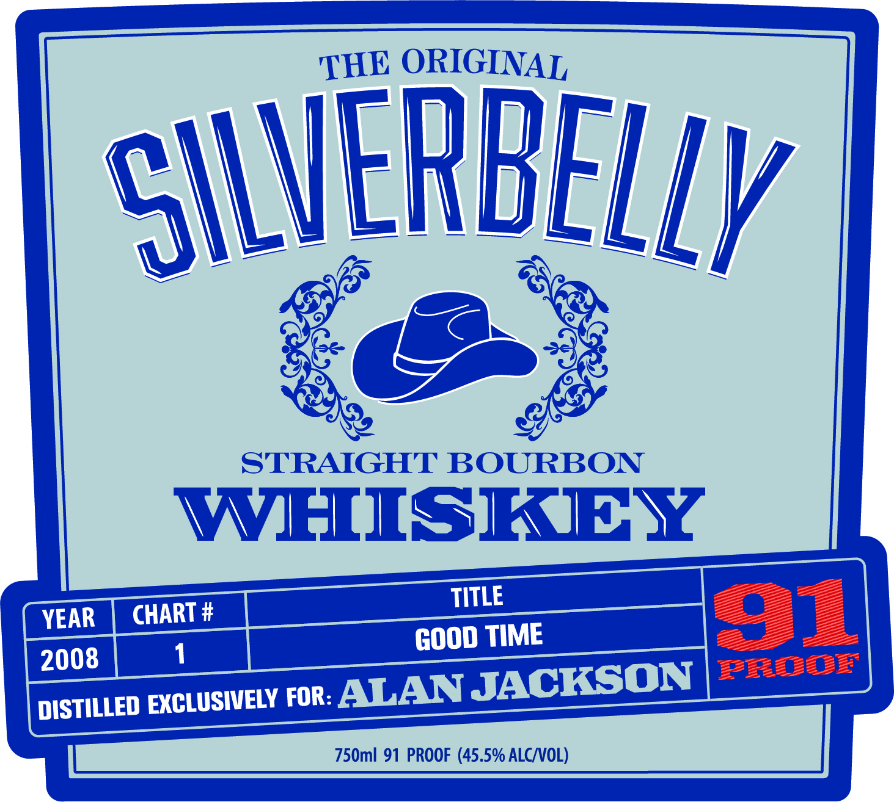
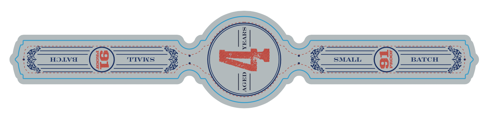
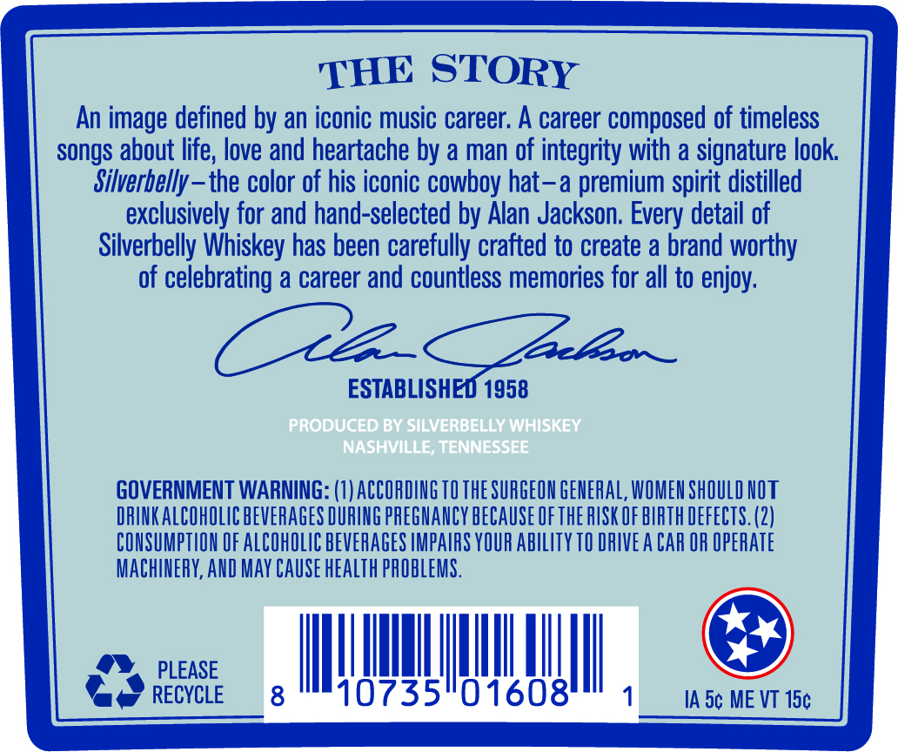

# TTB COLA Label Images - TTBID 26119001000129

**Brand Name:** SILVERBELLY WHISKEY

**Issue Date:** 05/04/2026

**Origin Code:** 43

**Product Class/Type:** 101

**Source:** [TTB Public COLA Registry](https://ttbonline.gov/colasonline/viewColaDetails.do?action=publicFormDisplay&ttbid=26119001000129)

## Label Images

### Label 1

### Label 2

### Label 3

## Extracted Label Text

*Text extracted via OCR - may contain errors*

*1 image(s) excluded: text did not meet readability threshold*

**Detected Proof:** 91

### Label 1

THE ORIGINAL
silVERbELLY
STRAIGHT BOURBON
WHISKIY
TITLE
YEAR
CHART #
91
GOOD TIME
2008
EEEEETEE'
DISTILLED EXGLUSIWELY FOR: ALAN JACKSON
750ml 91 PROOF (45.5% ALCNOL)

### Label 3

THE STORY
An image defined by an iconic music career: A career composed of timeless
songs about life; love and heartache by a man of integrity with a signature look
Silverbelly -
the color of his iconic cowboy hat-a premium spirit distilled
exclusively for and hand-selected by Alan Jackson. Every detail of
Silverbelly Whiskey has been carefully crafted to create a brand worthy
of celebrating a career and countless memories for all to enjoy;
3
3pereeo _
ESTABLISHED 1958
PRODUCED BY SILVERBELLY WHISKEY
NaSHVILLE; TENNESSEE
GOVERNMENT WARNING: (1) ACCORDINGTO THE SURGEON GENERAL, WOMEN SHOULD NOT
DRINK ALCOHOLIC BEVERAGES DURING PREGMANCY beCauSe Ofthe PUSK OF BIRTH DEFECTS. (2)
CONSUMPTLON OF ALCOHOLIC BEVERAGES IMPAIRS YOUR ability TO DRIVE A CAR OR OpeRATE
MAChinERY, AND May CAuSe health PROBLEMS.
PLEASE
RECYCLE
8
10735
01608
IA 5c ME VT 15c
