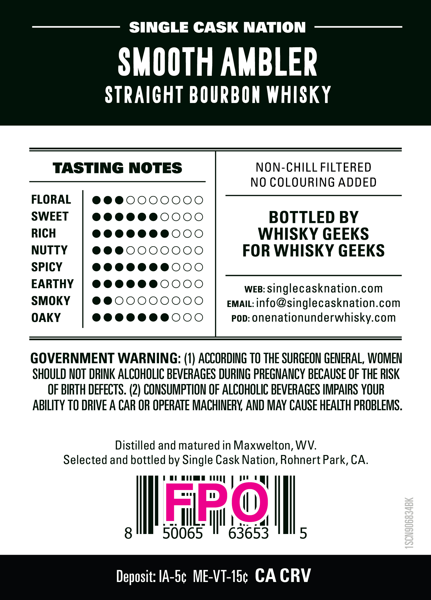
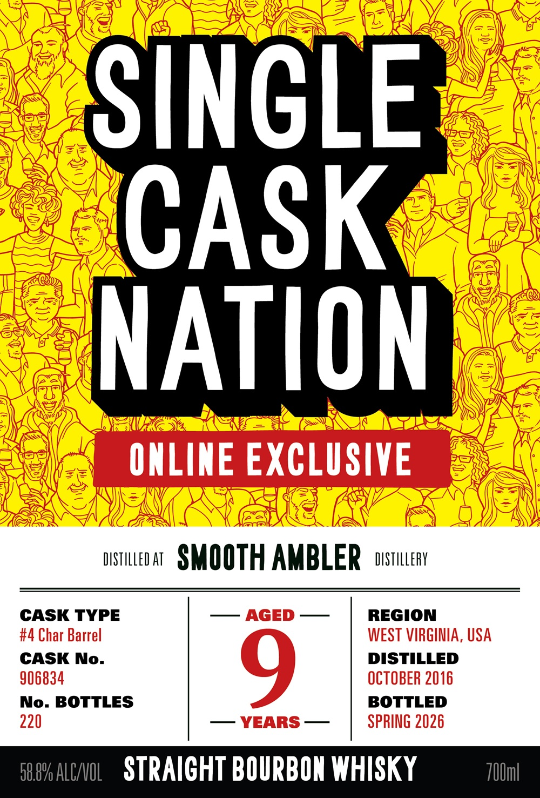

# TTB COLA Label Images - TTBID 26119001000138

**Brand Name:** SINGLE CASK NATION

**Fanciful Name:** SMOOTH AMBLER

**Issue Date:** 05/06/2026

**Origin Code:** 01

**Product Class/Type:** 101

**Source:** [TTB Public COLA Registry](https://ttbonline.gov/colasonline/viewColaDetails.do?action=publicFormDisplay&ttbid=26119001000138)

## Label Images

### Back Label

### Front Label

## Extracted Label Text

*Text extracted via OCR - may contain errors*

### Back Label

SINGLE CASK NATION
SMOOTH AMBLER
STRAICHT BOURBON WHISKY
TASTING NOTES
NON-CHILL FILTERED
NO COLOURING ADDED
FLORAL
SWEET
BOTTLED BY
RICH
WHISKY GEEKS
NUTTY
FOR WHISKY GEEKS
SPICY
EARTHY
WEB:
singlecasknation com
SMOKY
EMAIL:
info@singlecasknation.com
OAKY
POD:
onenationunderwhisky com
GOVERNMENT WARNING: (1) ACCORDING TO THE SURGEON GENERAL, WOMEN
SHOULD NOT DRINK ALCOHOLIC BEVERAGES DURING PREGHANCY BECAUSE OF THE RISK
OF BIRTH DEFECTS. (2) CONSUMPTION OF ALCOHOLIC BEVERAGES IMPAIRS YOUR
ABILITY TO DRIVE A CAR OR OPERATE MACHINERY AND MAY CAUSE HEALTH PROBLEMS.
Distilled and matured in Maxwelton, WV:
Selected and bottled by Single Cask Nation, Rohnert Park, CA
50065
Fm
63653
5
J
Deposit: IA-5c ME-VT-ISc CA CRV

### Front Label

SINGLE
CASK
NATION"
ONLINE EXCLUSIVE
DISTILLED AT
SMOOTH AMBLER
DISTILLERY
CASK TYPE
AGED
REGION
#4 Char Barrel
WEST VIRGINIA , USA
CASK No.
DISTILLED
906834
9
OCTOBER 2016
No- BOTTLES
BOTTLED
220
YEARS
SPRING 2026
58.89 ALCNNOL
STRAICHT BOURBON WHISKY
Z0Um]
