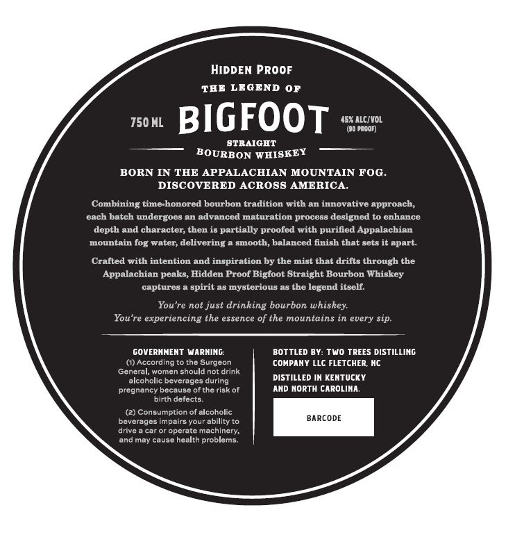
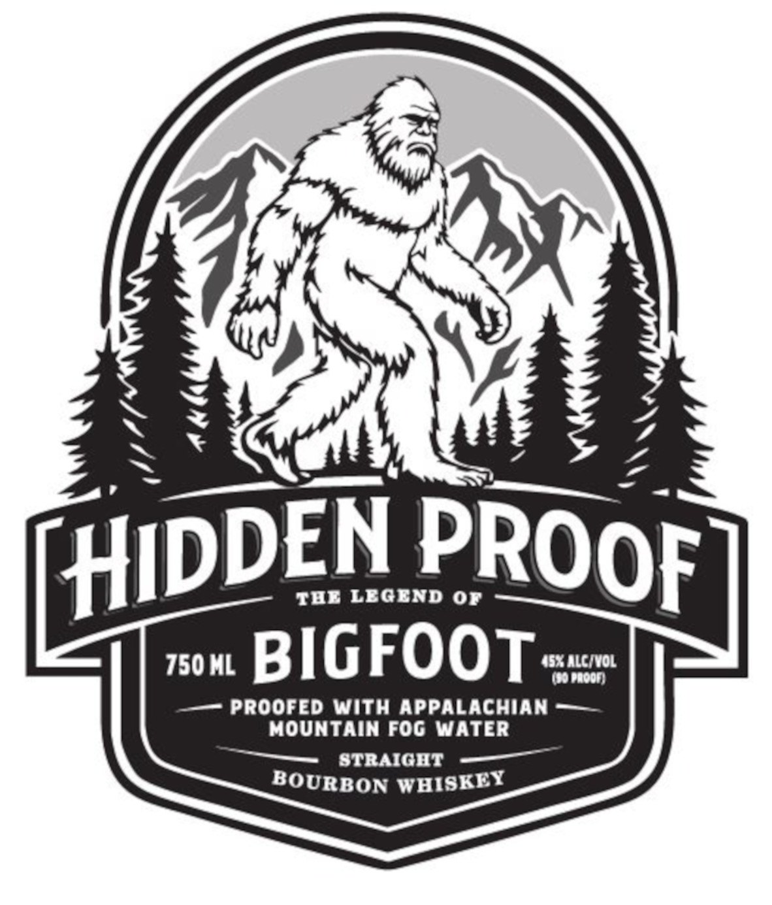
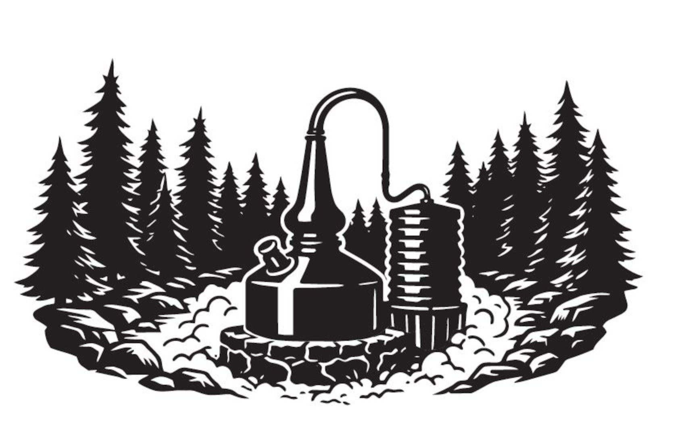

# TTB COLA Label Images - TTBID 26119001000149

**Brand Name:** HIDDEN PROOF

**Issue Date:** 05/01/2026

**Origin Code:** 35

**Product Class/Type:** 141

**Source:** [TTB Public COLA Registry](https://ttbonline.gov/colasonline/viewColaDetails.do?action=publicFormDisplay&ttbid=26119001000149)

## Label Images

### Back Label

### Front Label

### Label 3

## Extracted Label Text

*Text extracted via OCR - may contain errors*

*1 image(s) excluded: text did not meet readability threshold*

### Back Label

HIDDEN PROOF
TEB LEGEND
0F
750 ML
BIGFOOT
456 HCoFQL
BTRAIGHT
BOURBON
BORN IN THE APPALACHIAN MOUNTAIN FOG.
DISCOVERED ACROSS AMERICA.
Combining timehonored bourbon tradition with an innovative approach,
batch undergoes an advanced maturation process desigued to cnhance
depth and character; then is partially proofed with purified Appalachian
mountain fog water; delivering
smooth, balanced finish that sets it apart:
Crafted with intention and inspiration by the mist that drifts through the
Appalachian peaks; Hidden Proof Bigfoot Straight Bourbon Whiskey
captures
spirit a8 mysterious a5 the Icgend itsclf:
Youre not just drinking bourbon whiskey:
Youre experiencing the essence of the mountains in every sip.
GOVERMMENT WARNING:
BOTTLED BY: TWO TREES DISTILLING
(1) According to the Surgcon
COMPANY LLC FLETCHER; Nc
General; women should not drink
alcoholic beverages during
DISTILLED IN KENTUCKY
prcgnancy bccause of the risk of
AND North CAROLINA,
birth defects
(2) Consumption of alcoholic
beverages impairs your ability
BARCODE
drive
car or operate machinery;
and may cause health problems
WHISKEY
cach

### Front Label

TAE LEGEND 0r
750 ML
BIGFOOT
'5ncwvoL
Proofed With APPaLachian
MOUNTAIN Fog WaTER
STRAIGHT
BOURBON WHISKEY
[HIdDEN
PROOF
