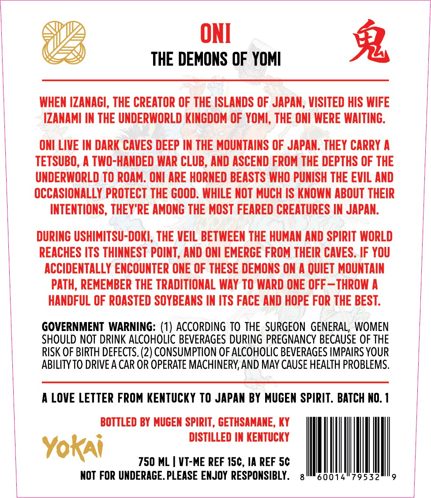
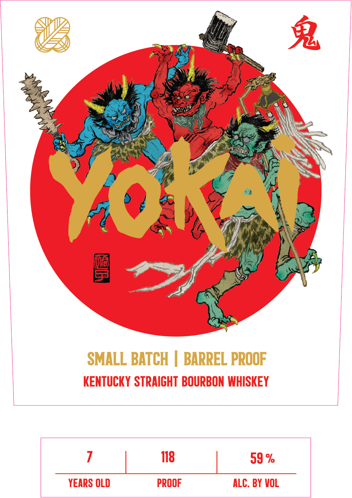

# TTB COLA Label Images - TTBID 26119001000194

**Brand Name:** YOKAI

**Issue Date:** 05/08/2026

**Origin Code:** 22

**Product Class/Type:** 101

**Source:** [TTB Public COLA Registry](https://ttbonline.gov/colasonline/viewColaDetails.do?action=publicFormDisplay&ttbid=26119001000194)

## Label Images

### Back Label

### Front Label

### Label 3

## Extracted Label Text

*Text extracted via OCR - may contain errors*

**Detected Proof:** 118

### Back Label

ONI
2
THE DEMONS OF YOMI
WHEN IZANAGI, THE CREATOR OF THE ISLANDS OF JAPAN, VISITED HIS WIFE
IZANAMI IN THE UNDERWORLD KINGDOM OF YOMI; THE ONI WERE WAITING.
ONI LIVE IN DARK CAVES DEEP IN THE MOUNTAINS OF JAPAN: THEY CARRY A
TETSUBO, A TWO-HANDED WAR CLUB, AND ASCEND FROM THE DEPTHS OF THE
UNDERWORLD TO ROAM . ONI ARE HORNED BEASTS WHO PUNISH THE EVIL AND
OCCASIONALLY PROTECT THE COOD. WHILE NOT MUCH IS KNOWN ABOUT THEIR
INTENTIONS;, THEY"RE AMONG THE MOST FEARED CREATURES IN JAPAN.
DURINC USHIMITSU-DOKI; THE VEIL BETWEEN THE HUMAN AND SPIRIT WORLD
REACHES ITS THINNEST POINT, AND ONI EMERGE FROM THEIR CAVES. IF YOU
ACCIDENTALLY ENCOUNTER ONE OF THESE DEMONS ON A QUIET MOUNTAIN
PATh; REMEMBER THE TRADITIONAL WAY TO WARD ONE OFF _THROW A
HANDFUL OF ROASTED SOYBEANS IN ITS FACE AND HOPE FOR THE BEST:
GOVERNMENT WARNING: (1) ACCORDING TO THE SURGEON GENERAL, WOMEN
SHOULD NOT DRINK ALCOHOLIC BEVERAGES DURING PREGNAnCY BECAUSE OF THE
RISK OF BIRTH DEFECTS. (2) CONSUMPTION OF ALCOHOLIC BEVERAGES IMPAIRS YOUR
ABILITY TO DRIVE A CAR OR OPERATE MACHINERY AND MAY CAUSE HEALTH PROBLEMS.
LOVE LETTER FROM KENTUCKY TO JAPAN BY MUGEN SPIRIT . BATCH NO.
BOTTLED BY MUGEN SPIRIT , GETHSAMANE, KY
DISTILLED IN KENTUCKY
Yokai
750 ML
VT-ME REF 15c, IA REF 5c
NOT FOR UNDERAGE. PLEASE ENJOY  RESPONSIBLY.
60014"79532

### Front Label

2
Yoka
9
SMALL BATCH
BARREL PROOF
KENTUCKY STRAIGHT BOURBON WHISKEY
118
59 %
YEARS OLD
PROOF
ALC. BY VOL

### Label 3

J18IN V
Ind J81
SwHjUU
4
6
CHOP
WOOD
CARRY
WATER
